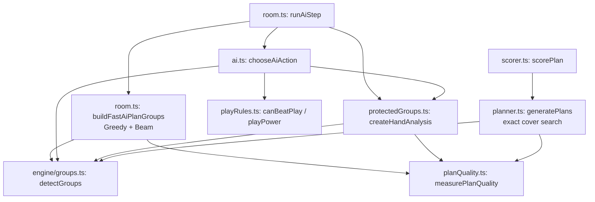
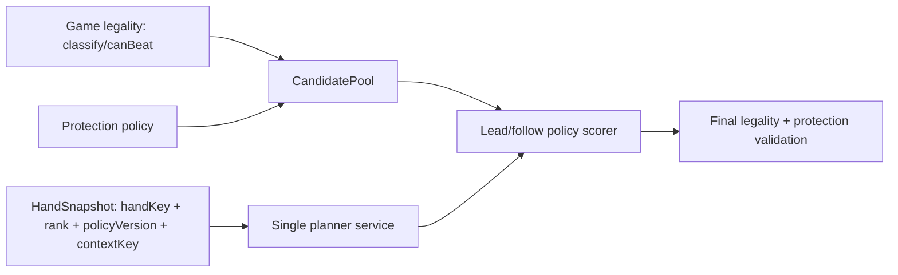

# AI 架构审计与基线冻结（2026-07-11）

## 范围与冻结结论

本次审计覆盖 `src/game/ai.ts`、`room.ts`、`protectedGroups.ts`、`playRules.ts`、`src/engine/planQuality.ts`、`planner.ts`、`scorer.ts` 及其游戏、引擎和性能测试。除可观测调用计数外，本阶段未改变候选顺序、评分、规则阈值、前端或 API。

## 当前模块与调用关系

主调用链为：`runAiStep` 先创建 `HandAnalysis`，按 `planCoversHand` 保留或重建 `AiPlanState`，再将过滤后的计划组与分析传给 `chooseAiAction`；最终经 `playCards`/`passTurn` 落地。首发候选进入 `chooseLeadAction`，跟牌候选进入 `chooseFollowAction`；二者最终通过保护断言。人工出牌由 `classifyPlay` 与 `canBeatPlay` 约束。

## 规则分层

| 层级 | 当前权威实现 | 内容 |
| --- | --- | --- |
| 游戏绝对合法性 | `playRules.ts`、`room.ts: playCards/passTurn` | 选牌能否分类、同型/长度/强度压制、炸弹权力比较、轮次和出牌权。 |
| 不可随意违反的策略政策 | `protectedGroups.ts`、`ai.ts: violatesLeadHardRule`、`room.ts` 首发兜底 | 不拆 HARD 强牌；条件炸弹降级；非空首发不得 pass；让队友控制。它们不是通用游戏规则。 |
| 可评分权衡的偏好 | `ai.ts` 的 lead/follow scores、`planQuality.ts`、`planner.ts` archetype weights、`scorer.ts` | 轮次数、低单、控制、连牌、鬼牌、尾牌和出牌成本。 |

## 重复功能矩阵

| 功能 | 实现位置 | 审计判断 |
| --- | --- | --- |
| 整手牌规划 | `planner.ts: generatePlans/selectBestCover`；`room.ts: buildFastAiPlanGroups` | 两套独立规划器。前者为精确搜索且生产热路径未直接调用；后者为快速贪心/Beam。 |
| Beam Search 与贪心兜底 | `planner.ts: selectBestCover`；`room.ts: buildBeamAiCover/buildGreedyAiCover` | 算法骨架、掩码覆盖、质量累加、确定性比较均重复。 |
| 强牌保护分类 | `protectedGroups.ts: detectProtectedGroupsFromGroups`；`planQuality.ts: protectedSourceGroups`；`planner.ts: exactProtectedGroupsForSearch/protectedNaturalBombs` | 三套定义：动作保护、质量损失、搜索状态并不完全同义。 |
| 炸弹降级 | `planQuality.ts: isLegalBombReduction`；`room.ts: isLegalRoomBombReduction`；`planner.ts: protectedBombEffectForGroup`；`protectedGroups.ts` 调用前者 | 规则核心可复用，但 room/planner 仍保有筛选与状态推进重复。 |
| 保护损失 | `planQuality.ts: countProtectedLoss`；`planner.ts: countProtectedLoss`；`room.ts` 通过 `measurePlanQuality` | 前两者分别按最终方案/搜索状态计算，维护风险高。 |
| 牌组评分 | `planner.ts: scoreGroup/wildcardStructureBonus`；`room.ts: aiPlanGroupScore`；`scorer.ts: scorePlan`；`ai.ts` 多个 action score | 目标不同但输入概念重叠；目前没有统一评分契约。 |
| 当前动作硬规则 | `playRules.ts` 合法性；`protectedGroups.ts` 候选拒绝；`ai.ts` 首发硬规则与最终断言；`room.ts` 首发兜底 | 同一动作跨四层过滤，存在绕过/语义漂移风险。 |
| 计划有效性管理 | `room.ts: planCoversHand/currentPlannedGroups/ensureAiPlanForSeat`；`ai.ts: availablePlannedGroups` | room 负责重建，AI 再过滤。`AiPlanState` 自身未携带版本或生成上下文。 |

## 已确认冲突与风险

1. **无安全首发候选时硬规则会绕过。** `chooseLeadAction` 在 `candidates.length === 0` 时改用全部 `actions`，因此 `violatesLeadHardRule` 是优先级很高的政策，不是不可突破的不变量；之后仅由强牌断言二次过滤。
2. **`createHandAnalysis` 混合静态和动态输入。** `handKey` 仅表示牌 ID，但 `normalCards`、`normalGroups`、`accepted` 会受到 `BombBreakContext` 影响；`HandAnalysis` 不记录该 context，不能安全按 `handKey` 单独缓存或复用到不同紧急拆炸授权。
3. **确有两套规划器。** `room.ts` 的快速规划器与 `planner.ts` 的完整规划器独立维护 Beam、贪心、炸弹保护和质量选择；前者才是 AI 房间运行时路径。
4. **强牌保护定义不一致。** 动作层把四张最大炸弹和同花顺视为 HARD，五张以上炸弹和王炸视为 CONDITIONAL；计划质量和搜索层则按自然炸弹、同花顺/王炸和可降级剩余炸弹判断。它们会在边界牌型上得出不同“保护”语义。
5. **`AiPlanState` 可能过期。** 它仅包含座位、名称、分数和组；有效性只检查剩余手牌的集合覆盖，不含 `handKey`、rank、分析版本、强牌上下文或策略版本。当前 rank 在房间内固定，因而普通出牌后可用；但将来加入动态上下文/规则版本后会静默复用旧计划。
6. `chooseAiAction` 用 `catch` 将内部异常转为首发兜底或 pass；这会隐藏非保护类编程错误，建议后续仅捕获明确的候选拒绝错误。

## 目标架构（建议，未实施）

建议保留 `playRules.ts` 作为唯一绝对合法性层；将保护策略建模为版本化 `HandSnapshot` 的一部分；让 `room.ts` 只管理缓存生命周期，规划实现收敛为一个可选择“快速/精确”策略的服务。评分只消费统一的候选/计划诊断，不再各自再定义保护语义。

## 分阶段迁移

1. 提取只读 `HandSnapshot` 与诊断类型，先让 `AiPlanState` 带 `handKey`、rank、policy/context version；保持 room 快速规划器不变。
2. 将 `room.ts` 的 `isLegalRoomBombReduction` 和保护筛选委托给 `planQuality.ts`/独立保护策略，并用本次基线测试锁定输出。
3. 抽取共享的掩码覆盖、贪心和 Beam 框架；用参数区分快速与精确搜索，删除 duplicated room/planner 算法。
4. 合并强牌保护与保护损失模型，明确动作拒绝与方案质量的不同级别。
5. 最后才校准 `ai.ts` 评分；每次改动对比固定种子 replay 与性能基线，独立声明策略提升。

## 风险与回滚

- 风险：统一保护定义会改变边界炸弹/同花顺候选，从而改变实际出牌。
- 风险：完整规划器替换热路径可能造成卡顿；先以固定输入 median/p95 和调用计数设预算。
- 风险：缓存版本不完整会复用错误候选；迁移时以快照键失配立即重建。
- 回滚：保留本次固定牌组 characterization tests、种子 41 的 16 步 replay 与性能输出；迁移按单独提交启用，出现行为漂移即恢复到 room 快速规划器。

## 基线测试与性能

新增 `tests/game/aiBaseline.test.ts` 固定牌组覆盖：首发非 pass、合法跟牌、队友控制过牌、对手仅一张时阻断、炸弹/同花顺/王炸 power 候选保护、合法五炸降级、完整无重复规划和相同输入确定性。

`tests/performance/aiHotPath.test.ts` 以固定牌和种子记录旧行为：分析、房间规划、单次决策的 median/p95，以及 `detectGroups`/`createHandAnalysis` 调用次数；种子 41 运行 16 个 AI 步并比较完整 action 序列的确定性。该阶段只记录基线，不宣称策略增强。

最近一次本机基线（Vitest 单文件运行；单位 ms）为：

| 指标 | median | p95 | 计数 |
| --- | ---: | ---: | ---: |
| 固定 12 张手牌的分析/决策路径 | 145.23 | 205.77 | `detectGroups`: 1425；`createHandAnalysis`: 18（整个基准用例） |
| 固定 seed=17 的房间计划生成 | 4239.54 | 4239.54 | 3 次样本 |
| 相同 12 张手牌的单次 AI 决策 | 123.56 | 190.32 | 9 次样本 |

种子 41 的 16 步 replay 已作为测试中的精确 action-ID 金样本冻结，而非只比较同次运行的两份临时结果。
