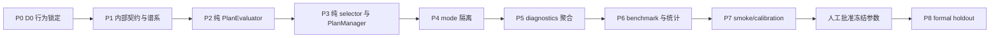

# D1 Top-K candidatePlans 动态计划切换实施计划

> **For agentic workers:** REQUIRED SUB-SKILL: Use superpowers:subagent-driven-development (recommended) or superpowers:executing-plans to implement this plan task-by-task. Steps use checkbox (`- [ ]`) syntax for tracking.

**Goal:** 在不改变 D0 keep-current 字节级行为的前提下，以测试先行方式实现并验证 benchmark-only 的 `dynamic-topk-v1` 计划切换、诊断、统计和 replay 流程。

**Architecture:** D1 状态通过可选的 `AiRuntimeState.planSelectionState` sidecar 隔离，只有 dynamic treatment 创建该 sidecar；keep-current（包括 benchmark control）不创建、补默认或序列化任何 D1 字段。纯 `PlanEvaluator` 只计算计划自身分数，纯 selector/`PlanManager` 负责结构验证、Top-K、阈值、seat-local cooldown 和 strategic A→B→A 规则；benchmark 仍位于 `tests/benchmark` 和 `scripts`，生产默认 mode 永远保持 keep-current。

**Tech Stack:** TypeScript 5.7、Vitest 2、Node.js `worker_threads`（仅 benchmark 并行）、现有真实 room/simulator、现有 JSON/Markdown report model、SHA-256 canonical hashing。

## Global Constraints

- 基线 commit：`cc3254eb65b4bbd4b63859a24c8247c2ef2a19db`；不得修改 `ai-benchmark-d0-baseline` tag、D0 artifacts 或 D0 manifest。
- 本计划执行前只新增本计划文档；实施阶段每个 P 阶段单独提交，前一阶段验证通过后才可进入下一阶段。
- P0 必须首先完成；P7 完成后必须暂停并等待人工批准；未批准不得执行 P8。
- production 默认 `PlanSelectionMode` 为 `keep-current`；D1 正式验收前不得切换 production 默认值。
- `PlanSelectionMode` 不得进入 `RoomState`、`PublicRoom`、网络协议或用户配置；benchmark control 显式传 `keep-current`，treatment 显式传 `dynamic-topk-v1`。
- keep-current 不创建 `planSelectionState`，不生成/写入/序列化 `rootPlanId`、`planFamilyId`、`lineageId`，不得给旧字段补默认值。
- D1 策略只能接收自身手牌、公开牌局信息和自身 runtime；不得接收 `partnerHand`、`opponentsHands`、全部 `hands`、deck 或隐藏初始状态。
- cooldown 是 seat-local decision index 的硬门禁：cooldown 内禁止 strategic switch；cooldown 结束后不再加任何 `cooldownPenalty`。
- 近期回切只使用软阈值：普通 `requiredDelta = minimumScoreDelta`；命中近期 strategic family 时 `requiredDelta = 2 × minimumScoreDelta`；达到阈值允许切换；forced switch 始终绕过阈值和 cooldown。
- 只有 strategic switch 更新 `recentStrategicPlanFamilyIds`；forced switch 只记 diagnostics，不进入 A→B→A 窗口；suppression、同分和普通保留不更新历史。
- P8 正式 holdout 固定为 smoke `201–220`、calibration `221–270`、formal holdout `1001–1200`；formal 不得使用 D0 的 `1–200`。
- 正式矩阵采用七组：treatment/control、treatment/greedy、control/greedy、treatment/random、control/random、treatment/legacy、control/legacy；每组 1600 raw games、800 paired units，总计 11200 raw games、5600 paired units。
- replay 物理文件为每个 raw game 一个 JSON；formal `replayMode = all`，主报告不嵌入完整轨迹或隐藏状态。
- 不以 `process.exit`、强制 kill 或跳过失败替换资源清理问题；worker、timer、MessagePort、writer、锁和 diagnostics 必须自然关闭。

---

## 1. 实施边界与稳定接口

### 1.1 D1 sidecar 状态

为保持 D0 runtime shape，选择 sidecar 方案而不是无条件扩展 `HandPlan`：

```ts
type PlanIdentity = {
  rootPlanId: string;
  planFamilyId: string;
  lineageId: string;
};

type D1PlanSelectionState = {
  version: "d1-topk-runtime-v1";
  activePlanId?: string;
  previousPlanId?: string;
  activePlanFamilyId?: string;
  previousPlanFamilyId?: string;
  lastPlanSwitchDecisionIndex?: number;
  planSwitchCount: number;
  fullReplanCount: number;
  recentStrategicPlanFamilyIds: string[];
  planIdentityById: Readonly<Record<string, PlanIdentity>>;
};

type AiRuntimeStateWithD1 = AiRuntimeState & {
  planSelectionState?: D1PlanSelectionState;
};
```

`planSelectionState` 只由 `dynamic-topk-v1` 创建。`keep-current` 的返回 runtime 必须与 D0
完全相同：属性不存在、JSON 字节序列不变、action 不变、`publicTraceHash` 不变。sidecar 中的
family/root/lineage 也不进入 `HandPlan`、D0 replay 或 D0 report。

### 1.2 唯一 cooldown 语义

实施时只允许以下判定顺序：

```text
if forcedInvalid(active):
    switch immediately
else if decisionIndex[seat] - lastPlanSwitchDecisionIndex < cooldownDecisionIndices:
    keep active; reason = cooldown-suppressed
else:
    requiredDelta = recentStrategicPlanFamilyIds contains challengerFamily
      ? 2 * minimumScoreDelta
      : minimumScoreDelta
    switch only when bestChallengerScore - activeScore >= requiredDelta
```

`cooldownPenalty` 从实现和报告中删除；cooldown 结束后不重复扣分。`lastPlanSwitchDecisionIndex`
在 strategic switch 时更新；forced switch 不更新该 strategic cooldown 时钟，但要增加 forced diagnostics。

### 1.3 稳定 ID

`canonicalPlanInput` 必须稳定排序 JSON key、group stable key、card ID，并以固定六位小数序列化
数值；输入中包含 `schemaVersion`、`roomRulesVersion`、`strategyId`、`strategyVersion`、`configHash`、
seat、seat-local `fullReplanCount`、规范化 groups 和规范化 metrics。不得包含时间、随机数、duration、
diagnostics 耗时、路径或对象引用。

```text
rootPlanId   = sha256("d1-root-v1|" + canonicalPlanInput)
planFamilyId = sha256("d1-family-v1|" + rootPlanId + "|" + fullReplanCount)
lineageId    = sha256("d1-lineage-v1|" + parentLineageIdOrRoot + "|" + canonicalDeltaInput)
```

初始计划 `fullReplanCount = 0`；每次完整重规划先递增，因此即使候选内容相同也生成新 family。
增量继承/局部修复复用 root/family，仅生成新 lineage；只有实际 strategic switch 才追加
`recentStrategicPlanFamilyIds`。旧 runtime 有可验证 active plan 时确定性迁移；缺少可验证 plan、ordinal
或 identity 时标记 `migration-required`，沿既有结构性 replan 生成新 identity，不合成时间/随机默认值。

### 1.4 联合 paired uplift

每个 base seed 的 8 局作为一个 block。先对每个 matchup 计算该 block 的 paired score/win-rate
difference，再按相同 base seed 做联合差分：

```text
greedyUplift[b] = treatmentVsGreedy[b] - controlVsGreedy[b]
randomUplift[b] = treatmentVsRandom[b] - controlVsRandom[b]
legacyUplift[b] = treatmentVsLegacy[b] - controlVsLegacy[b]
```

bootstrap 每次抽取同一组 base-seed blocks，并同时取两 matchup 的 block 值；不得构造两个独立 CI
后相减。点估计为 block uplift 的均值，CI 为固定 bootstrap seed/iterations 的 percentile CI。

---

## 2. 工作包依赖图



P0–P5 是 production/测试逐步实现，但每个阶段都必须保持 keep-current lock；P6 之后才允许在
`tests/benchmark` 注册 treatment adapter。P7 是强制暂停点；P8 只有人工批准 artifact 与批准 commit
存在时才能启动。

---

## 3. 文件级修改清单

| 工作包 | 修改文件 | 新增文件 | 责任边界 |
|---|---|---|---|
| P0 | 无 production 文件 | `tests/ai/keepCurrentCharacterization.test.ts`、`tests/ai/keepCurrentRuntimeShape.test.ts`、`tests/benchmark/keepCurrentLock.test.ts` | 锁定 D0 action/runtime/hash，证明可选字段不污染 D0 |
| P1 | `src/ai/contracts.ts`（只增加可选 type）、必要时 `tests/ai/aiDecisionMigration.test.ts` | `src/ai/planning/planSelectionContracts.ts`、`src/ai/planning/planIdentity.ts`、`tests/ai/planSelectionContracts.test.ts`、`tests/ai/planIdentity.test.ts`、`tests/ai/strategicHistory.test.ts` | 内部上下文、sidecar state、canonical identity、migration、history |
| P2 | `src/ai/planning/planEvaluator.ts` | `tests/ai/planEvaluator.test.ts`、`tests/ai/planEvaluatorBoundaries.test.ts` | 纯评分，不调用 PlanManager、不写 runtime |
| P3 | `src/ai/planning/planManager.ts` | `src/ai/planning/planSelector.ts`、`tests/ai/planSelector.test.ts`、`tests/ai/planManagerD1.test.ts` | 结构过滤、Top-K、threshold、cooldown、strategic history、stable tie-break |
| P4 | `src/ai/aiDecisionEngine.ts`、必要时 `src/ai/contracts.ts` | `tests/ai/planSelectionMode.test.ts`、`tests/ai/keepCurrentByteLock.test.ts` | 内部 mode 注入，production/control keep-current 与 treatment dynamic 隔离 |
| P5 | `src/ai/diagnostics/aiPlanningDiagnostics.ts` | `tests/ai/d1DiagnosticsAggregation.test.ts`、`tests/ai/d1DiagnosticsPrivacy.test.ts` | 聚合统计、debug-only decision detail、隐私边界 |
| P6 | 仅 `tests/benchmark` / `scripts` | `tests/benchmark/d1Matrix.ts`、`tests/benchmark/d1Statistics.ts`、`tests/benchmark/d1ReplayValidation.ts`、`tests/benchmark/d1Calibration.ts`、`scripts/runD1TopKBenchmark.ts`、`scripts/replayD1TopKBenchmark.ts`、`scripts/freezeD1Calibration.ts`、对应 focused tests | 七组矩阵、联合 uplift、manifest、resume、replay all、approval artifact |
| P7 | 仅 `tests/benchmark` / `scripts` | `artifacts/ai-benchmark-d1-calibration-*.json/.md`（默认外部归档）、`artifacts/ai-benchmark-d1-calibration-approval.json` | smoke/calibration，不运行 formal，生成待批准报告 |
| P8 | 仅 `tests/benchmark` / `scripts` | `artifacts/ai-benchmark-d1-topk-switch-<matchup>.*`、batch/replay/debug 外部归档 | 28 个 formal batch、原子落盘、断点续跑、最终统计 |

P0–P5 不能修改 `src/game/room.ts`、D0 strategy descriptor、D0 artifact 或 D0 tag；P6–P8 不能把
D1 artifact 写入 `ai-benchmark-baseline.*`。

---

## 4. P0：D0 行为锁定

**目标：** 在引入任何 D1 selector 之前，建立可重复的 D0 keep-current characterization。

**文件：**

- 新增 `tests/ai/keepCurrentCharacterization.test.ts`：固定 lead、follow、合法 pass、重规划和动作后 runtime 场景。
- 新增 `tests/ai/keepCurrentRuntimeShape.test.ts`：断言 `planSelectionState`、family/root/lineage 不存在。
- 新增 `tests/benchmark/keepCurrentLock.test.ts`：以 D0 tag 生成的固定 observation/seed fixture 验证 action、runtime canonical bytes、public trace hash。
- 不修改 production 文件；D0 fixture 只读保存于 `tests/ai/fixtures/d0KeepCurrentCases.json`（如需要新增，必须纳入本阶段提交）。

**先写的 characterization/保护测试：**（P0 以 D0 为基线，正常情况下应立即通过；任何新增 D1 代码导致它们失败即为回归。）

1. 同一 observation/runtime/config 连续调用两次，`canonicalizeD0Runtime(result.runtime)`、action key 和 hash 完全相等。
2. lead、follow、legal pass、incremental action 后四个 fixture 的结果与 D0 reference snapshot 完全相等。
3. `Object.hasOwn(result.runtime, "planSelectionState") === false`，并断言 JSON 不含 `planFamilyId`、`rootPlanId`、`lineageId`。
4. benchmark control 显式 keep-current 与 production 默认调用的 action/runtime/publicTraceHash 完全相等。

**最小实现步骤：**

- 先从 D0 tag 的既有 engine API 读取 reference 输出，不添加 mode 或 state。
- 只实现测试 fixture canonicalizer；canonicalizer 排除耗时字段，但不得改变 runtime 内容。
- 若现有测试发现不稳定，先修复 fixture 的排序/比较，不修改 AI 行为。

**验证命令：**

```powershell
npx vitest run tests/ai/keepCurrentCharacterization.test.ts tests/ai/keepCurrentRuntimeShape.test.ts tests/benchmark/keepCurrentLock.test.ts --testTimeout=120000
npx tsc --noEmit
git diff --check
```

预期：新增测试全部 PASS，production source 无 diff，runtime 不出现 D1 字段。

**完成条件：** D0 四类场景 action/runtime/hash 锁定通过；默认和 control keep-current 字节级一致；没有动态 selector、treatment adapter 或 benchmark 运行。

**可回滚提交点：** `d1-p0-keep-current-lock`，只包含测试与 fixture；回滚该提交不会触碰 D0 tag/artifacts。

**keep-current 风险：** 目标为零；本阶段不得修改 production 行为。

**预估运行时间：** 2–5 分钟（focused tests + tsc）。

---

## 5. P1：内部契约、可选 runtime 与谱系测试

**目标：** 建立不污染 D0 的 planning 内部契约、sidecar state、稳定 identity、migration 和 strategic history。

**接口：**

```ts
export type PlanSelectionMode = "keep-current" | "dynamic-topk-v1";
export type PlanSelectionContext = Readonly<{
  seat: number;
  partnerSeat: number;
  gameRank: GameRank;
  handCount: number;
  handCounts: Readonly<Record<number, number>>;
  lastPlay?: CardGroup;
  lastPlaySeat?: number;
  finishOrder: readonly number[];
  partnerPassedCurrentTrick?: boolean;
  playedCards: readonly Card[];
  candidatePlans: readonly HandPlan[];
  handAnalysis: Readonly<HandAnalysis>;
  powerGroupPolicyIndex: Readonly<PowerGroupPolicyIndex>;
}>;
export type PlanIdentity = { rootPlanId: string; planFamilyId: string; lineageId: string };
export function canonicalPlanInput(input: CanonicalPlanInput): string;
export function createPlanIdentity(input: IdentityInput): PlanIdentity;
export function migrateD1State(runtime: AiRuntimeState, context: MigrationContext): MigrationResult;
```

**文件：**

- 修改 `src/ai/contracts.ts`：只增加可选 `planSelectionState?: D1PlanSelectionState` 和 type-only 引用，不给 runtime 构造器补默认对象。
- 新增 `src/ai/planning/planSelectionContracts.ts`：定义 `PlanSelectionContext`、`PlanSelectionMode`、`PlanScore`、`PlanSelectionResult`、`D1PlanSelectionState`。
- 新增 `src/ai/planning/planIdentity.ts`：canonical JSON、stable group/card order、SHA-256 identity、migration。
- 新增 `tests/ai/planSelectionContracts.test.ts`、`tests/ai/planIdentity.test.ts`、`tests/ai/strategicHistory.test.ts`。

**先写的失败测试：**

1. `PlanSelectionContext` 的运行时对象不含 hidden fields；静态扫描拒绝 `partnerHand`、`opponentsHands`、`hands`、deck。
2. 同一 normalized input 生成相同三种 ID；groups/cards、Map/Set 输入顺序打乱后字符串和 ID 不变。
3. 时间、随机数、diagnostics duration 和路径字段不存在于 canonical input。
4. 增量/局部修复保持 root/family、只变 lineage；full replan increment 后生成新 root/family/lineage。
5. 只有 strategic switch 追加 `recentStrategicPlanFamilyIds`；forced、suppression、tie 和 keep 不追加。
6. 旧 D0 runtime 缺少 sidecar 时，keep-current 不补字段；dynamic migration 有可验证 active plan 时确定性生成 identity；不可验证时返回 `migration-required`。

**最小实现步骤：**

- 先定义 type-only contracts，避免顶层 `contracts.ts` 反向依赖 analysis/policy。
- 用固定 key-sort canonicalizer；card/group 依 stable key 排序，数字固定六位小数。
- 用 Node `createHash("sha256")` 生成 identity；`fullReplanCount` 由 seat-local runtime 递增。
- 在 sidecar 中实现 strategic history 更新函数，forced path 只写 diagnostics。

**验证命令：**

```powershell
npx vitest run tests/ai/planSelectionContracts.test.ts tests/ai/planIdentity.test.ts tests/ai/strategicHistory.test.ts tests/ai/aiDecisionMigration.test.ts --testTimeout=120000
npx tsc --noEmit
```

预期：新增测试 PASS；P0 keep-current lock 仍 PASS；`git diff --check` PASS。

**完成条件：** internal contract 可被后续 evaluator/selector 使用；D0 runtime shape 在 keep-current 下不变；stable IDs 和 migration 有反例测试；strategic history 与 forced 完全分离。

**可回滚提交点：** `d1-p1-contracts-and-lineage`。

**keep-current 风险：** 低；只允许可选 type 与未调用的纯工具。若任何 P0 snapshot 变化，回滚本阶段，不进入 P2。

**预估运行时间：** 3–8 分钟。

---

## 6. P2：纯 PlanEvaluator

**目标：** 在不接入 PlanManager 的情况下实现可重复、可解释、无重复计分的计划自身评分。

**精确公式：** 所有组件先 clamp，再 round 到 6 位小数；最终 score 以 `Math.round(score * 1_000_000)` 比较。

```text
norm(value, max) = clamp(value / max, 0, 1), max = max(1, handSize)
turnFit        = 1 - clamp(estimatedTurns / 20, 0, 1)
singleFit      = 1 - norm(lowSingleCount, handSize)
controlFit     = norm(retainedControl, handSize)
wildcardFit    = norm(wildcardFlexibility, handSize)
responseFit    = norm(responseCoverage, handSize)
leadFit        = norm(leadFlexibility, handSize)

staticPlanQuality = 10*turnFit + 6*singleFit + 8*controlFit
                  + 6*wildcardFit + 5*responseFit + 5*leadFit       // [0,40]

immediatePlayability =
  15, if a legal lead/beat group exists
  5 + 5*trickFit, if no beat group but legal pass exists
  0, only for structurally invalid plan

tempoFit = 10 * turnFit

endgameFit(n) =
  4 * clamp((20-n)/10, 0, 1), n > 10
  10 - (n-5)*6/5,            5 < n <= 10
  10,                         n <= 5

opponentPressureFit(m) =
  3 * clamp((14-m)/8, 0, 1), m > 6
  3 + (6-m)*3/2,             4 <= m <= 6
  6 + (3-m)*2,               1 <= m <= 3
  10,                         m <= 0

partnerContextFit = clamp(publicPartnerFit, 0, 10)
powerGroupRisk = 15 * clamp(
  0.6 * norm(protectionLoss, handSize)
  + 0.4 * norm(policyRiskUnits, handSize), 0, 1)

dynamicPlanScore = staticPlanQuality + immediatePlayability + tempoFit
                 + endgameFit + partnerContextFit + opponentPressureFit
                 - powerGroupRisk
```

`policyRiskUnits` 必须来自 policy index 的固定范围风险摘要；hard policy violation 在 evaluator 前过滤。
`protectionLoss` 只在 `powerGroupRisk` 读取，不能进入 static quality。无可跟牌但 pass 合法时不被过滤，
`immediatePlayability` 使用 5–10 的 trickFit。

**文件：** 修改 `src/ai/planning/planEvaluator.ts`；新增 `tests/ai/planEvaluator.test.ts`、`tests/ai/planEvaluatorBoundaries.test.ts`。

**先写的失败测试：**

1. 每一项输出在规定范围内，NaN/Infinity 变为明确失败而不是静默排序。
2. `n=10`、`n=5` 和 `m=6`、`m=4`、`m=3` 左右两侧 score 差小于 `1e-6`，无跳变。
3. pass 合法但没有 beat group 的计划仍有 5–10 分且未被 evaluator 过滤。
4. 同一 `protectionLoss` 不会在 static quality 和 powerGroupRisk 中出现两次。
5. evaluator 不读取 runtime、不调用 PlanManager/HandPlanner、不输出 `requiredScoreDelta` 或 cooldown penalty。
6. 固定浮点格式和候选输入顺序变化产生相同 breakdown/total。

**最小实现步骤：**

- 先加入 clamp/round/fixed-range helper，再实现各分项纯函数。
- 把 evaluator 输出限制为 `{ planId, staticPlanQuality, components, total }`，不携带切换状态。
- 用 immutable input，禁止写 `HandPlan.metrics`；在 P2 测试中 mock PlanManager 证明无调用。

**验证命令：**

```powershell
npx vitest run tests/ai/planEvaluator.test.ts tests/ai/planEvaluatorBoundaries.test.ts --testTimeout=120000
npx vitest run tests/ai/keepCurrentCharacterization.test.ts tests/ai/keepCurrentRuntimeShape.test.ts --testTimeout=120000
npx tsc --noEmit
```

**完成条件：** 公式、端点、clamp、浮点和 protectionLoss 规则均有测试；P0/P1 测试继续通过；PlanEvaluator 尚未接入 PlanManager。

**可回滚提交点：** `d1-p2-pure-plan-evaluator`。

**keep-current 风险：** 中低；修改 evaluator 文件但默认 path 不调用新 evaluator。P0 任何变化都阻止进入 P3。

**预估运行时间：** 4–10 分钟。

---

## 7. P3：纯 selector 与 PlanManager 规则

**目标：** 实现 active + K-1 challengers 的确定性选择，并严格分离 forced validity、strategic threshold、cooldown 和回切 soft threshold。

**接口与顺序：**

```ts
export function selectActivePlan(input: {
  context: PlanSelectionContext;
  candidates: readonly HandPlan[];
  activePlanId?: string;
  state: D1PlanSelectionState;
  mode: "dynamic-topk-v1";
  constants: FrozenD1Constants;
}): PlanSelectionResult;
```

1. 先过滤结构不完整、缺牌、重复、非法 group、hard policy violation；当前 trick 无 beat group 但 pass 合法不构成过滤。
2. 取静态质量最高的 K-1 个 challenger，再强制加入 active；K=5 时 active 始终参与。
3. 独立求 active score 和最高 challenger score；不得在评分前优先 active。
4. active 结构 invalid 时 forced switch，绕过 cooldown、threshold 和 return threshold。
5. 结构有效时先检查 `lastPlanSwitchDecisionIndex !== undefined && decisionIndex[seat] - lastPlanSwitchDecisionIndex < cooldownDecisionIndices`；是则禁止 strategic switch，不添加 penalty。undefined 表示该 seat 尚无 strategic switch，不在 cooldown 内。
6. cooldown 结束后，近期 strategic family 回切使用 `2 × minimumScoreDelta`，否则使用 `minimumScoreDelta`；达到阈值即允许 switch。
7. 同分、未达阈值或 suppression 保留 active；stable tie-break 只用于已确定的保留/切换集合。
8. strategic switch 更新 `lastPlanSwitchDecisionIndex`、`recentStrategicPlanFamilyIds` 和计数；forced 只记录 diagnostics。

**文件：** 修改 `src/ai/planning/planManager.ts`；新增 `src/ai/planning/planSelector.ts`、`tests/ai/planSelector.test.ts`、`tests/ai/planManagerD1.test.ts`。

**先写的失败测试：**

1. K=5 时 active 不在静态前四仍被评分；challengers 按 static quality/stable ID 选出。
2. active 缺失、覆盖不完整、重复牌、非法 group、hard policy violation 立即 forced；pass 合法不 forced。
3. active/challenger 分数独立计算，challenger delta 未达阈值不切换。
4. cooldown 内 strategic switch 被硬禁止且没有 `cooldownPenalty`；cooldown 结束后不重复惩罚。
5. 近期 strategic A→B→A 使用 `2 × minimumScoreDelta`，达到阈值允许切换；普通候选使用 `minimumScoreDelta`。
6. forced switch 不受 cooldown/return threshold，不进入 `recentStrategicPlanFamilyIds`。
7. suppression、tie、普通保留不更新 strategic history。
8. stable tie-break 不依赖 Map/Set、对象引用、文件顺序或 worker 调度；不调用 HandPlanner。

**最小实现步骤：**

- 先实现纯 `selectActivePlan`，注入 evaluator 函数和 frozen constants，避免隐藏全局状态。
- 再让 PlanManager 只负责 active validity、sidecar state 更新和 selector 调用。
- 保持现有 `ensurePlans`/incremental reuse 逻辑；D1 identity 仅在 dynamic mode 建立。

**验证命令：**

```powershell
npx vitest run tests/ai/planSelector.test.ts tests/ai/planManagerD1.test.ts tests/ai/planManager.test.ts --testTimeout=120000
npx vitest run tests/ai/planEvaluator.test.ts tests/ai/keepCurrentByteLock.test.ts --testTimeout=120000
npx tsc --noEmit
```

**完成条件：** 选择顺序和唯一 cooldown 语义有覆盖；forced/strategic history 分离；selector 纯且不运行完整 HandPlanner；P0–P2 全部通过。

**可回滚提交点：** `d1-p3-selector-and-manager`。

**keep-current 风险：** 中等；PlanManager 是现有路径。实现必须以 mode guard 包围 D1 分支，P0 lock 任一失败立即回滚本提交。

**预估运行时间：** 5–12 分钟。

---

## 8. P4：aiDecisionEngine mode 隔离

**目标：** 只为内部 benchmark adapter 注入 mode；默认 production 与 benchmark control 完全保持 D0。

**文件：** 修改 `src/ai/aiDecisionEngine.ts`，必要时只增加 `src/ai/contracts.ts` 的 type-only `PlanSelectionMode`；新增 `tests/ai/planSelectionMode.test.ts`、`tests/ai/keepCurrentByteLock.test.ts`。

**先写的失败测试：**

1. 不传 mode 的 production 调用等价于 `keep-current`，runtime 不含 `planSelectionState`。
2. benchmark control 显式 `keep-current` 仍不创建 sidecar，action/runtime/publicTraceHash 与默认调用一致。
3. treatment 显式 `dynamic-topk-v1` 才创建 D1 sidecar，并产生 identity/history。
4. mode 不出现在 `RoomState`、`PublicRoom`、网络序列化、用户配置或 replay public payload。
5. diagnostics on/off 不改变 keep-current 或 dynamic 的 action、runtime public fields 和 publicTraceHash。

**最小实现步骤：**

- 使用内部 invocation option 传 `PlanSelectionMode`；不把 mode 加入 RoomState/PublicRoom/AiObservation。
- 默认未提供 mode 时走 D0 keep-current 分支，不创建任何 D1 object。
- benchmark control 仅通过 adapter 显式传 keep-current；treatment adapter 暂不在 P4 注册，留到 P6。

**验证命令：**

```powershell
npx vitest run tests/ai/planSelectionMode.test.ts tests/ai/keepCurrentByteLock.test.ts tests/ai/aiDecisionEngine.test.ts --testTimeout=120000
npx vitest run tests/ai/aiDecisionMigration.test.ts --testTimeout=120000
npx tsc --noEmit
```

**完成条件：** 三种 mode 的边界行为锁定；keep-current 字节级行为不变；没有 treatment registration、benchmark 执行或 RoomState 字段。

**可回滚提交点：** `d1-p4-mode-isolation`。

**keep-current 风险：** 高；直接修改 aiDecisionEngine。任何 action、runtime shape 或 hash 差异都必须回滚并修复后才能继续。

**预估运行时间：** 4–8 分钟。

---

## 9. P5：diagnostics 聚合与 privacy

**目标：** decision-level breakdown 仅在显式 debug artifact；主报告只保留聚合计数、比例和分位数。

**文件：** 修改 `src/ai/diagnostics/aiPlanningDiagnostics.ts`；新增 `tests/ai/d1DiagnosticsAggregation.test.ts`、`tests/ai/d1DiagnosticsPrivacy.test.ts`。

**先写的失败测试：**

1. 普通 diagnostics 只输出 `forcedSwitchCount`、`strategicSwitchCount`、`switchSuppressedByCooldown`、`switchSuppressedByHysteresis`、`AToBToARate`、switch rate、p50/p95 等聚合字段。
2. `planScoreBreakdown`、逐 decision 序列、候选详细牌组只在 `debug-full-state = true` 且独立 debug 目录中输出；默认关闭。
3. 主报告不含 partnerHand/opponentsHands/hands/deck/hidden initial hand，递归扫描 `hiddenStateLeakCount = 0`。
4. forced switch 计入 diagnostics 但不计入 `recentStrategicPlanFamilyIds` 或 A→B→A rate。
5. diagnostics on/off、debug on/off 不改变动作、runtime public shape 或 publicTraceHash。

**最小实现步骤：**

- 以 ephemeral decision record 累计聚合；普通 report serializer 只接收 aggregate model。
- debug writer 使用独立 `artifacts/ai-benchmark-debug-d1/`，显式开启才创建，并在 teardown flush/close。
- 增加递归 forbidden-key scanner；错误栈、路径、duration 不进入 public hash。

**验证命令：**

```powershell
npx vitest run tests/ai/d1DiagnosticsAggregation.test.ts tests/ai/d1DiagnosticsPrivacy.test.ts tests/ai/aiPlanningDiagnostics.test.ts --testTimeout=120000
npx tsc --noEmit
```

**完成条件：** 普通报告无逐 decision 数据；debug artifact 可选且隔离；privacy 扫描为 0；P0–P4 仍通过。

**可回滚提交点：** `d1-p5-diagnostics-aggregate`。

**keep-current 风险：** 中等；diagnostics 默认关闭且不得改变行为。P0/P4 lock 变化时回滚。

**预估运行时间：** 3–7 分钟。

---

## 10. P6：benchmark、联合统计、manifest 与 replay all

**目标：** 在 tests/scripts 内建立七组 D1 runner、联合 paired uplift、校准 approval artifact、resume/skip-existing 和 replay 完整性验证；本阶段不运行 formal holdout。

### 10.1 七组与 seed 配置

```text
matchups = [
  treatment-control,
  treatment-greedy,
  control-greedy,
  treatment-random,
  control-random,
  treatment-legacy,
  control-legacy,
]
smoke       = 201..220   // 20 base seeds, 160 raw/group
calibration = 221..270   // 50 base seeds, 400 raw/group
formal      = 1001..1200 // 200 base seeds, 1600 raw/group
```

每个 base seed 固定 2 placements × 4 rotations = 8 raw games；每个 matchup 的 formal 200 seeds 为 800
paired units。config canonical hash 必须覆盖 mode、strategy descriptor/version、constants、caps、seed set、
room rules、replay/schema/benchmark version；配置不一致的 batch 拒绝合并。

### 10.2 replay all 语义

- 逻辑记录单位：一个 raw game `matchId`；paired unit 和 base-seed block 只在统计层聚合，不生成替代 replay 记录。
- 物理文件单位：`artifacts/ai-benchmark-replays-d1-topk-switch/<matchup>/<matchId>.json`，每个 raw game 一个文件。
- formal 每组预期 1600 个 replay 文件、七组合计 11200；formal `replayMode = all`。smoke/calibration 默认 `failures`，只有失败/不完整 raw game 写 replay，除非显式 calibration debug all。
- replay 必须包含 `schemaVersion`、`benchmarkVersion`、`roomRulesVersion`、strategyDescriptors、configHash、seed、rotation、placement、strategiesBySeat、public action sequence、handCount/trick/贡还公开事件、finishOrder、team result、deterministic random provenance、`finalPublicStateHash`。
- replay 不得含 partnerHand、opponentsHands、全部 hands、deck、隐藏初始手牌；debug-full-state 另目录且不进入 report。

manifest 至少包含：`phase`、`matchup`、`replayMode`、`configHash`、`expectedMatchIds`、`completedMatchIds`、
`replayFilesExpected`、`replayFilesFound`、`replayFilesVerified`、`hashVerified`、`versionVerified`、
`hiddenStateLeakCount`、`provenanceMissing`、`nonPositiveDuration`、`duplicateMatchIds`、`missingMatchIds`、
`unknownMatchIds`、`batchIds`、`resumeSupported`、`skipExistingSupported`。

完整性判定：

```text
expectedReplayFiles = rawGames                     // replayMode=all
replayCountOk = found == expected && no duplicate/unknown matchId
hashOk = every canonicalPublicTrace(replay) sha256 == result.publicTraceHash
finalStateOk = replay.finalPublicStateHash == recomputedFinalPublicStateHash
versionOk = replay versions == manifest versions == frozen config versions
privacyOk = forbiddenKeyCount(partnerHand, opponentsHands, hands, deck, hiddenInitialHand) == 0
provenanceOk = every seed/rotation/placement/strategy/config/random provenance present
replayIntegrityOk = replayCountOk && hashOk && finalStateOk && versionOk && privacyOk && provenanceOk
```

### 10.3 文件与测试

**文件：**

- 修改仅限 `tests/benchmark/strategies.ts`（注册 treatment descriptor）、必要时 `tests/benchmark/contracts.ts`。
- 新增 `tests/benchmark/d1Matrix.ts`、`tests/benchmark/d1Statistics.ts`、`tests/benchmark/d1ReplayValidation.ts`、`tests/benchmark/d1Calibration.ts`。
- 新增 `scripts/runD1TopKBenchmark.ts`、`scripts/replayD1TopKBenchmark.ts`、`scripts/freezeD1Calibration.ts`。
- 新增 `tests/benchmark/d1Matrix.test.ts`、`tests/benchmark/d1Statistics.test.ts`、`tests/benchmark/d1ReplayValidation.test.ts`、`tests/benchmark/d1Resume.test.ts`、`tests/benchmark/d1Calibration.test.ts`。

**先写的失败测试：**

1. 七组名称、seed ranges、raw/paired counts 和 configHash 字段完整且无 D0 overlap。
2. 同一 base seed 的 8 局 block 产生一个 paired unit block；joint uplift 使用相同 block，不允许两个独立 CI 相减。
3. 固定 bootstrap `iterations=10000`、`seed=20260714` 的结果重复运行字节稳定；bootstrap 元数据写入 report。
4. replay all 预期每组 1600/总计 11200；manifest counts、hash、version、privacy、provenance 全通过。
5. 缺失/重复/未知 matchId、configHash、version、publicTraceHash、duration 或 provenance 时验证失败，不跳过或替换。
6. batch 原子落盘后 `resume`/`skip-existing` 恢复；错误 configHash batch 拒绝合并。
7. worker_threads concurrency=1 与 N 的候选、action、hash、runtime（排除耗时）一致；worker 不共享 runtime、diagnostics、RNG 或 mutable cache。

**最小实现步骤：**

- 复用真实 `createRoom`、`playCards`、`passTurn` simulator，不复制规则。
- 先实现 manifest/config canonical hash 和原子 batch writer，再接七组 descriptor。
- 实现 block-level statistics 与 joint uplift bootstrap；独立 matchup CI 仍保留，但 uplift 不相减独立 CI。
- 实现 replay validator 和 privacy scanner；最后接 CLI 参数 `--phase smoke|calibration|formal`、`--resume`、`--skip-existing`、`--concurrency`。

**验证命令：**

```powershell
npx vitest run tests/benchmark/d1Matrix.test.ts tests/benchmark/d1Statistics.test.ts tests/benchmark/d1ReplayValidation.test.ts tests/benchmark/d1Resume.test.ts tests/benchmark/d1Calibration.test.ts --testTimeout=120000 --reporter=verbose
npx tsc --noEmit
```

预期：focused tests PASS；不执行 `scripts/runD1TopKBenchmark.ts --phase formal`。

**完成条件：** 七组和联合 uplift 统计契约固定；replay all/manifest/resume 验证可用；treatment descriptor 仅存在 benchmark adapter；尚未生成 formal artifact。

**可回滚提交点：** `d1-p6-benchmark-statistics-and-replay`。

**keep-current 风险：** 中低；只修改 tests/scripts 和 descriptor adapter。control 必须显式 keep-current 且不创建 sidecar。

**预估运行时间：** 10–25 分钟（focused tests、无正式模拟）。

---

## 11. P7：冒烟与 50-seed 校准（强制暂停）

**目标：** 运行 smoke 201–220 与 calibration 221–270，生成校准记录和待批准冻结 artifact；严禁运行 formal 1001–1200。

**文件：**

- 修改 `scripts/runD1TopKBenchmark.ts` 的 phase gate 和 `scripts/freezeD1Calibration.ts` 的 approval validation。
- 新增 `tests/benchmark/d1CalibrationFlow.test.ts`、`tests/benchmark/d1FormalGate.test.ts`。
- 新增/归档 `artifacts/ai-benchmark-d1-calibration-<configHash>.json/.md` 和 approval template；不写入 D0 artifact。

**先写的失败测试：**

1. `--phase smoke` 只接受 201–220，`--phase calibration` 只接受 221–270，任何 formal seed 或 D0 seed 重叠都失败。
2. calibration 报告缺少任一冻结参数、behavior cap、margin、bootstrap metadata 或 configHash 时，`freezeD1Calibration.ts --validate-only` 失败。
3. `formalExecutionAllowed = false` 或缺少 reviewer/approval commit 时，formal runner 必须拒绝启动。

**最小实现步骤：**

- 先锁 phase seed validator 和 `formalExecutionAllowed=false` gate。
- 再运行 smoke/calibration，按七组写入原子 batch 和校准报告。
- 最后生成人工 approval template；不在脚本中自动把 false 改为 true。

**运行计划：**

1. smoke：七组各 20 seeds，1120 raw games、560 paired units；`replayMode = failures`。
2. calibration：七组各 50 seeds，2800 raw games、1400 paired units；`replayMode = failures`，必要时只对失败样本显式 debug all。
3. 不修改策略权重、规划预算、room rules、统计口径或 D0 artifact。

**校准记录文件：**

`artifacts/ai-benchmark-d1-calibration-<configHash>.json` 和 `.md` 必须包含：

- 实际 seed ranges、七组 counts、raw/paired results、joint uplift preview；
- `minimumScoreDelta`、K、cooldown decision indices、A→B→A multiplier；
- `forcedSwitchRate`、`strategicSwitchRate`、`switchSuppressionRate`、`AToBToARate`；
- 候选 `approvedBehaviorCaps`、`greedyImprovementMargin`、`randomNonInferiorityMargin`、`legacyNonInferiorityMargin`；
- bootstrap iterations/seed（初始 `10000`/`20260714`）、implementationVersion、strategy descriptors、roomRulesVersion、configHash；
- replay/hash/version/privacy/provenance summary；
- `formalExecutionAllowed: false`。

**人工批准点：**

由 reviewer 在校准报告和固定 commit 上逐项确认：

```text
[ ] minimumScoreDelta 已批准
[ ] K 已批准
[ ] cooldownDecisionIndices 已批准，且无 cooldownPenalty
[ ] AToBToA requiredDelta = 2 × minimumScoreDelta 已批准
[ ] strategicSwitchRate 上限已批准
[ ] forcedSwitchRate 上限已批准
[ ] AToBToARate 上限已批准
[ ] switchSuppressionRate 作为描述指标/批准区间，不被误当作简单上限
[ ] greedyImprovementMargin 已批准
[ ] randomNonInferiorityMargin 已批准
[ ] legacyNonInferiorityMargin 已批准
[ ] bootstrap iterations 和 seed 已批准
[ ] implementationVersion、descriptors、roomRulesVersion、configHash 已批准
[ ] formal seeds 1001–1200 与 D0 1–200 不重叠
[ ] formalExecutionAllowed 仍为 false，等待明确批准
```

冻结文件 `artifacts/ai-benchmark-d1-calibration-approval.json` 必须记录 `approvedAt`、reviewer、
approval commit、所有冻结常量、`approvedBehaviorCaps`、三个 non-inferiority/improvement margins、
bootstrap metadata 和最终 configHash。批准前不得创建 formal manifest 或 formal replay batch。

**验证命令：**

```powershell
npx tsx scripts/runD1TopKBenchmark.ts --phase smoke --replay-mode failures --concurrency 1
npx tsx scripts/runD1TopKBenchmark.ts --phase calibration --replay-mode failures --concurrency 1
npx tsx scripts/freezeD1Calibration.ts --validate-only
npx vitest run tests/benchmark/d1Calibration.test.ts tests/benchmark/d1ReplayValidation.test.ts --testTimeout=120000 --reporter=verbose
```

**完成条件：** smoke/calibration 全部 batch 原子落盘；校准报告和 approval template 生成；formal 未运行；流程暂停等待人工批准。

**可回滚提交点：** `d1-p7-smoke-calibration-ready`。校准 artifact 外部归档，不覆盖 D0。

**keep-current 风险：** 低；control 显式 keep-current，P7 不改变 production 默认 mode。

**预估运行时间：** smoke 约 5–20 分钟；calibration 约 15–60 分钟，取决于当前 simulator 的单局实测；不包含人工审批等待时间。

---

## 12. P8：正式 holdout（仅批准后）

**文件：**

- 修改 `scripts/runD1TopKBenchmark.ts` 的 formal gate、batch loop 和 atomic writer；修改 `scripts/replayD1TopKBenchmark.ts` 的 all-mode validator。
- 修改 `tests/benchmark/d1Matrix.ts`、`tests/benchmark/d1ReplayValidation.ts`、`tests/benchmark/d1Statistics.ts` 以读取 frozen approval。
- 新增 `tests/benchmark/d1FormalExecution.test.ts`、`tests/benchmark/d1FormalManifest.test.ts`、`tests/benchmark/d1FormalResume.test.ts`。
- 新增 formal batch/replay/report 外部归档文件；不得覆盖 D0 `ai-benchmark-baseline.*`。

**先写的失败测试：**

1. 没有 `formalExecutionAllowed=true`、approval commit/HEAD/configHash 不一致时，formal CLI 拒绝启动。
2. 任一 50-seed batch 不是 400 raw/200 paired/all replay，或 expected/completed matchId 集合不相等时，batch 失败且不合并。
3. 断点续跑只跳过通过 provenance/hash/version/privacy/duration 校验的结果；失败/超时/非法动作不能替换。
4. 28 batches 完成后七组总数为 11200 raw/5600 paired，三组 uplift 使用联合 block bootstrap。

**最小实现步骤：**

- 先实现 approval gate 和 frozen config verifier，再实现单个 matchup 的 50-seed atomic batch。
- 通过 resume/skip-existing 演练后扩展到七组 28 batches。
- 最后运行 all replay validator、聚合 ordinary paired statistics 和 joint uplift；不在运行中修改参数。

**前置门禁：** 必须存在 `artifacts/ai-benchmark-d1-calibration-approval.json`，其 `formalExecutionAllowed = true`、
approval commit 等于待执行 HEAD、configHash 与 runner 一致，且 P7 全部测试 PASS。缺任何一项，CLI 必须拒绝启动。

**正式配置：**

- seeds `1001–1200`，七组严格 matchup；
- 每组 1600 raw games、800 paired units；总计 11200 raw games、5600 paired units；
- `replayMode = all`；
- frozen `minimumScoreDelta`、K、cooldown、A→B→A threshold、behavior caps、margins、bootstrap iterations/seed、implementationVersion、configHash；
- treatment `dynamic-topk-v1`，control `keep-current`；production 默认仍 keep-current。

**批次与断点续跑：**

- 每个 matchup 按 50 base seeds 分成 4 批：`1001–1050`、`1051–1100`、`1101–1150`、`1151–1200`。
- 七组共 28 个 formal batch；每批每组 400 raw games、200 paired units、400 replay files。
- 稳定 `batchId = d1-topk-v1/<matchup>/<start>-<end>/<configHash>`；`matchId` 由 matchup、seed、placement、rotation、rank、strategy descriptors、configHash 规范化生成。
- 每批先写同目录临时文件，再 flush/close，fsync 后原子 rename；成功后更新 manifest 的 `completedMatchIds`。
- `--resume` 只读取同 configHash、同 implementationVersion、同 seed range 的 batch；`--skip-existing` 只跳过已通过 provenance/hash/version/privacy/duration 校验的 matchId。
- 失败、超时、非法动作、缺 provenance 或 hash mismatch 不得替换为成功结果；batch 必须标记失败并停止合并。
- 下一批启动前必须验证上一批 `resume`/`skip-existing` 可恢复，且 `expectedMatchIds == completedMatchIds`。

**逐批验证命令：**

```powershell
npx tsx scripts/runD1TopKBenchmark.ts --phase formal --matchup treatment-control --seed-start 1001 --seed-end 1050 --replay-mode all --resume --skip-existing --concurrency 1
npx tsx scripts/replayD1TopKBenchmark.ts --manifest <batch-manifest> --verify all
npx vitest run tests/benchmark/d1Resume.test.ts tests/benchmark/d1ReplayValidation.test.ts --testTimeout=120000 --reporter=verbose
```

每批通过后记录 raw games、paired units、duration、errors/timeouts/illegal actions、replay/hash/version/privacy/provenance；全 28 批完成后再聚合七组普通 paired statistics 和三组 joint uplift。

**完成条件：** 28 批均原子落盘且无缺失/重复/未知 matchId；七组 raw/paired 数量正确；formal replay 11200/11200（若 `all`）；joint uplift 使用同 base-seed block bootstrap；所有 frozen config/version/hash 一致；D0 tag/artifacts 未修改。

**可回滚提交点：** 每批只回滚对应 D1 batch commit/外部归档，不回滚 D0；代码集成提交为 `d1-p8-formal-holdout`，仅在所有验收通过后创建。

**keep-current 风险：** 中；正式 runner 同时执行 control/treatment。若 control action/runtime/hash 与 P0 lock 不同，立即停止，不继续其他 matchup。

**预估运行时间：** 28 批 × 当前单组 50-seed 实测时间；预计 2–8 小时（`concurrency=1`），若启用 worker_threads 并行需重新验证 hash/资源清理后再估算，不得用 Promise 并发冒充 CPU 并行。

---

## 13. 测试矩阵映射

| 设计/验收要求 | P0 | P1 | P2 | P3 | P4 | P5 | P6 | P7 | P8 |
|---|---:|---:|---:|---:|---:|---:|---:|---:|---:|
| D0 keep-current action/runtime/hash 字节锁定 | ✓ | ✓ |  |  | ✓ | ✓ | ✓ | ✓ | ✓ |
| optional sidecar、无旧字段默认污染 | ✓ | ✓ |  |  | ✓ |  |  |  |  |
| canonical root/family/lineage 与 migration |  | ✓ |  | ✓ |  |  |  |  |  |
| 评分公式/clamp/连续边界/protectionLoss |  |  | ✓ |  |  |  |  |  |  |
| active + K-1、forced validity、stable tie-break |  |  |  | ✓ |  |  |  |  |  |
| cooldown 唯一硬门禁、回切软阈值 |  |  |  | ✓ | ✓ |  |  | ✓ | ✓ |
| mode 不进入 RoomState/PublicRoom |  |  |  |  | ✓ | ✓ | ✓ | ✓ | ✓ |
| diagnostics 聚合/debug/privacy |  |  |  |  |  | ✓ | ✓ | ✓ | ✓ |
| 七组矩阵、seed disjoint、联合 uplift |  |  |  |  |  |  | ✓ | ✓ | ✓ |
| replay all、manifest、resume、skip-existing |  |  |  |  |  |  | ✓ | ✓ | ✓ |
| formal 11200 raw / 5600 paired |  |  |  |  |  |  |  |  | ✓ |

每个阶段结束必须运行该阶段 focused tests 和 `npx tsc --noEmit`；P4/P6/P8 额外运行 `git diff --check`。
正式全量 `npm test`、`npm run build` 和 production static scan 只在实现阶段全部代码完成后执行，不在本计划文档提交阶段运行。

---

## 14. 风险清单与缓解

| 风险 | 触发信号 | 缓解/停止条件 |
|---|---|---|
| keep-current runtime shape 被污染 | `planSelectionState` 出现在默认/control runtime | P0/P4 lock 失败立即回滚；不补默认字段 |
| cooldown 重复惩罚或硬/软语义混用 | 代码出现 `cooldownPenalty` 或 cooldown 内仍 strategic switch | P3 focused test 必须拒绝；只保留 decision-index hard gate + post-cooldown threshold |
| forced switch 污染 A→B→A | forced family 出现在 `recentStrategicPlanFamilyIds` | P1/P3 history test 失败即停 |
| ID 不稳定 | 输入顺序/worker 调度改变 hash | canonicalization property test；禁止对象顺序、时间、随机数 |
| hidden-state leak | replay/debug/report 出现 forbidden key | privacy scanner 非 0 立即删除 artifact 并停止 batch，不得继续合并 |
| treatment 进入 production | RoomState/PublicRoom/mode default 变化 | 静态扫描和 keep-current lock；未通过不得注册默认 treatment |
| uplift 错误相减 CI | 两个独立 CI 被直接相减 | d1Statistics test 要求同 base-seed block 联合 bootstrap |
| configHash 漂移 | batch manifest hash 不一致 | 拒绝 merge；新参数必须新 experiment version |
| batch 部分落盘 | expected/completed 不相等或 resume 失败 | 原子 writer、manifest lock、下一批前恢复演练 |
| worker 资源泄漏 | npm test 不退出、worker/port/timer 存活 | 先 concurrency=1；worker_threads 仅在 cleanup tests 通过后启用 |
| 校准过拟合或门槛漂移 | formal 前仍改常量/margins | P7 approval artifact + frozen configHash；P8 CLI 拒绝不匹配 |

---

## 15. 校准后的人工批准检查点

P7 的唯一出口是人工批准，不接受隐式批准或“先跑 formal 再补记录”。批准人必须在同一 review 中检查：

1. 七组 smoke/calibration 数量、seed disjoint、D0 overlap=0；
2. forced/strategic/suppression/A→B→A 指标及 caps；其中 strategic/forced/return 是上限，suppression 是描述指标或批准区间；
3. `minimumScoreDelta`、K、cooldown decision indices、A→B→A `2×` threshold；确认无 cooldown penalty；
4. greedy improvement、random non-inferiority、legacy non-inferiority margins；
5. bootstrap iterations/seed、joint uplift 公式和 block sampling；
6. implementationVersion、strategy descriptors、roomRulesVersion、schema/benchmark/replay versions、configHash；
7. replay/privacy/hash/version/provenance 摘要；
8. P0 keep-current lock 仍通过；production default、RoomState、PublicRoom 未改变；
9. approval JSON 的 `formalExecutionAllowed` 从 false 改为 true 仅在明确批准后发生，并提交批准记录。

---

## 16. 完成定义与阶段提交约定

- 每个 P 阶段都有独立 commit、focused tests、`npx tsc --noEmit` 和完成条件记录。
- P0 是第一提交；P1–P6 任何失败不得进入后续阶段；P7 完成后强制暂停。
- P8 只有人工批准 artifact、冻结 configHash 和对应 HEAD 同时存在时才允许运行。
- D1 正式验收前 production 默认仍为 keep-current；不修改 D0 tag、D0 artifacts、D0 manifest。
- P8 完成后另行运行 focused benchmark/replay tests、`npm test`、`npm run test:ai-performance`、`npx tsc --noEmit`、`npm run build`、`git diff --check` 和 production static scan；这些不是本轮文档提交的执行内容。

本计划只提交文档，不开始任何 P0–P8 实施、treatment 注册或 benchmark 运行。
