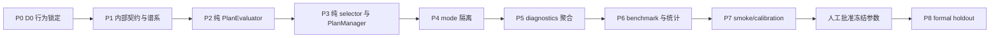

# D1 Top-K candidatePlans 动态计划切换实施计划

> **For agentic workers:** REQUIRED SUB-SKILL: Use superpowers:subagent-driven-development (recommended) or superpowers:executing-plans to implement this plan task-by-task. Steps use checkbox (`- [ ]`) syntax for tracking.

**Goal:** 在不改变 D0 keep-current 字节级行为的前提下，以测试先行方式实现并验证 benchmark-only 的 `dynamic-topk-v1` 计划切换、诊断、统计和 replay 流程。

**Architecture:** D1 状态通过可选的 `AiRuntimeState.planSelectionState` sidecar 隔离，只有 dynamic treatment 创建该 sidecar；keep-current（包括 benchmark control）不创建、补默认或序列化任何 D1 字段。纯 `PlanEvaluator` 只计算计划自身分数，纯 selector/`PlanManager` 负责结构验证、Top-K、阈值、seat-local cooldown 和 strategic A→B→A 规则；benchmark 仍位于 `tests/benchmark` 和 `scripts`，生产默认 mode 永远保持 keep-current。

**Tech Stack:** TypeScript 5.7、Vitest 2、Node.js `worker_threads`（仅 benchmark 并行）、现有真实 room/simulator、现有 JSON/Markdown report model、SHA-256 canonical hashing。

## Global Constraints

- 基线 commit：`cc3254eb65b4bbd4b63859a24c8247c2ef2a19db`；不得修改 `ai-benchmark-d0-baseline` tag、D0 artifacts 或 D0 manifest。
- 本计划执行前只新增本计划文档；实施阶段每个 P 阶段单独提交，前一阶段验证通过后才可进入下一阶段。
- P0 必须首先完成；P7 完成后必须暂停并等待人工批准；未批准不得执行 P8。
- production 默认 `PlanSelectionMode` 为 `keep-current`；D1 正式验收前不得切换 production 默认值。
- `PlanSelectionMode` 不得进入 `RoomState`、`PublicRoom`、网络协议或用户配置；P4 才验证显式 `keep-current`，P6 才注册 treatment adapter。
- keep-current 不创建 `planSelectionState`，不生成/写入/序列化 `rootPlanId`、`planFamilyId`、`lineageId`，不得给旧字段补默认值。
- D1 策略只能接收自身手牌、公开牌局信息和自身 runtime；不得接收 `partnerHand`、`opponentsHands`、全部 `hands`、deck 或隐藏初始状态。
- cooldown 是 seat-local decision index 的硬门禁：cooldown 内禁止 strategic switch；cooldown 结束后不再加任何 `cooldownPenalty`。
- 近期回切只使用软阈值：普通 `requiredDelta = minimumScoreDelta`；命中近期 strategic family 时 `requiredDelta = 2 × minimumScoreDelta`；达到阈值允许切换；forced switch 始终绕过阈值和 cooldown。
- 只有 strategic switch 更新 `recentStrategicPlanFamilyIds`；forced switch 更新 `lastAnyPlanSwitchDecisionIndex` 并记 diagnostics，但不进入 A→B→A 窗口；suppression、同分和普通保留不更新历史。
- 行为 caps 中 `strategicSwitchRate`、`forcedSwitchRate`、`AToBToARate` 是上限；`switchSuppressionRate` 只作描述指标或批准区间，不能简单当作上限。
- P8 正式 holdout 固定为 smoke `201–220`、calibration `221–270`、formal holdout `1001–1200`；formal 不得使用 D0 的 `1–200`。
- 正式矩阵采用七组：treatment/control、treatment/greedy、control/greedy、treatment/random、control/random、treatment/legacy、control/legacy；每组 1600 raw games、800 paired units，总计 11200 raw games、5600 paired units。
- replay 物理文件为每个 raw game 一个 JSON；formal `replayMode = all`，主报告不嵌入完整轨迹或隐藏状态。
- 不以 `process.exit`、强制 kill 或跳过失败替换资源清理问题；worker、timer、MessagePort、writer、锁和 diagnostics 必须自然关闭。

---

## 1. 实施边界与稳定接口

### 1.1 D1 sidecar 状态

为保持 D0 runtime shape，选择 sidecar 方案而不是无条件扩展 `HandPlan`：

```ts
type PlanIdentity = {
  rootPlanId: string;
  planFamilyId: string;
  lineageId: string;
};

type D1PlanSelectionState = {
  version: "d1-topk-runtime-v1";
  activePlanId?: string;
  previousPlanId?: string;
  activePlanFamilyId?: string;
  previousPlanFamilyId?: string;
  migrationVersion?: "d0-to-d1-v1";
  lastAnyPlanSwitchDecisionIndex?: number;
  planSwitchCount: number;
  fullReplanCount: number;
  recentStrategicPlanFamilyIds: string[];
  planIdentityById: Readonly<Record<string, PlanIdentity>>;
};

type AiRuntimeStateWithD1 = AiRuntimeState & {
  planSelectionState?: D1PlanSelectionState;
};
```

`planSelectionState` 只由 `dynamic-topk-v1` 创建。`keep-current` 的返回 runtime 必须与 D0
完全相同：属性不存在、JSON 字节序列不变、action 不变、`publicTraceHash` 不变。sidecar 中的
family/root/lineage 也不进入 `HandPlan`、D0 replay 或 D0 report。

### 1.2 唯一 cooldown 语义

实施时只允许以下判定顺序：

```text
if forcedInvalid(active):
    switch immediately
else if lastAnyPlanSwitchDecisionIndex !== undefined
     && decisionIndex[seat] - lastAnyPlanSwitchDecisionIndex < cooldownDecisionIndices:
    keep active; reason = cooldown-suppressed
else:
    requiredDelta = recentStrategicPlanFamilyIds contains challengerFamily
      ? 2 * minimumScoreDelta
      : minimumScoreDelta
    switch only when bestChallengerScore - activeScore >= requiredDelta
```

`cooldownPenalty` 从实现和报告中删除；cooldown 结束后不重复扣分。任何实际 forced/strategic switch
都更新 `lastAnyPlanSwitchDecisionIndex`，因此后续 strategic switch 受同一 seat-local cooldown 约束；
forced switch 本身绕过此前 cooldown，但不进入 `recentStrategicPlanFamilyIds`，A→B→A 仍只读取 strategic history。

### 1.3 稳定 ID

`canonicalPlanInput` 必须稳定排序 JSON key、group stable key、card ID，并以固定六位小数序列化
数值；输入中包含 `schemaVersion`、`roomRulesVersion`、`strategyId`、`strategyVersion`、`configHash`、
seat、seat-local `fullReplanCount`、规范化 groups 和规范化 metrics。不得包含时间、随机数、duration、
diagnostics 耗时、路径或对象引用。

```text
rootPlanId   = sha256("d1-root-v1|" + canonicalPlanInput)
planFamilyId = sha256("d1-family-v1|" + rootPlanId + "|" + fullReplanCount)
lineageId    = sha256("d1-lineage-v1|" + parentLineageIdOrRoot + "|" + canonicalDeltaInput)
```

`planIdentityById` 的 `maxPlanIdentityEntries = K + 2`。这里“当前 candidate set”严格指：active、
本次实际评价的 K-1 个 challengers，以及在容量允许且仍被引用的 necessary previous；不得承诺保存所有原始
`candidatePlans`。每次候选集更新时先保留 active（active identity 永不删除），再保留实际评价的 challengers，
最后保留仍被引用的 previous；若超出上限，按 `required(active) > current challenger(staticPlanQuality DESC, stablePlanId ASC) > referenced previous > other` 的优先级，
对可删除项按 `stablePlanId DESC` 清理。清理不得依赖对象插入顺序；没有 identity 的 previous 不得伪造。
首次从可验证 D0 runtime 迁移到 dynamic sidecar 时，`fullReplanCount = 0`、`migrationVersion = "d0-to-d1-v1"`，
按 D0 active plan 的规范化输入确定性生成 root/family/lineage，不触发完整重规划。只有 active 不存在、
结构非法、覆盖不完整、缺牌、重复或无法验证时，才返回 `migration-required` 并走既有完整重规划。
完整重规划先在临时 state 计算新 identity，只有完整候选集、active 和 runtime
成功提交后才递增并持久化 count，因此失败 replan 不消耗 ordinal；即使候选内容相同也生成新 family。
增量继承/局部修复复用 root/family，仅生成新 lineage；只有实际 strategic switch 才追加
`recentStrategicPlanFamilyIds`。D0 runtime 即使缺少 ordinal 或 identity，只要 active plan 可验证，仍按上述首次迁移规则确定性生成 sidecar；
只有 active 不存在、结构非法、覆盖不完整、缺牌、重复或无法验证时才标记 `migration-required`，沿既有结构性 replan 生成新 identity，不合成时间/随机默认值。

### 1.4 联合 paired uplift

每个 base seed 的 8 局作为一个 block。先对每个 matchup 计算该 block 的 paired score/win-rate
difference，再按相同 base seed 做联合差分：

```text
greedyUplift[b] = treatmentVsGreedy[b] - controlVsGreedy[b]
randomUplift[b] = treatmentVsRandom[b] - controlVsRandom[b]
legacyUplift[b] = treatmentVsLegacy[b] - controlVsLegacy[b]
```

bootstrap 每次抽取同一组 base-seed blocks，并同时取两 matchup 的 block 值；不得构造两个独立 CI
后相减。点估计为 block uplift 的均值，CI 为固定 bootstrap seed/iterations 的 percentile CI。

---

## 2. 工作包依赖图



P0–P5 是 production/测试逐步实现，但每个阶段都必须保持 keep-current lock；P6 必须一次性实现并测试
formal gate、28-batch loop、atomic writer、resume/skip-existing 和 replay all，之后才允许在
`tests/benchmark` 注册 treatment adapter。P7 只运行 smoke/calibration，是强制暂停点；P8 仅执行
已批准且不可再修改的 formal 代码。

---

## 3. 文件级修改清单

| 工作包 | 修改文件 | 新增文件 | 责任边界 |
|---|---|---|---|
| P0 | 无 production 文件 | `tests/ai/keepCurrentCharacterization.test.ts`、`tests/ai/keepCurrentRuntimeShape.test.ts`、`tests/benchmark/keepCurrentLock.test.ts`、`tests/ai/fixtures/d0KeepCurrentCases.json`、`scripts/generateD0KeepCurrentFixtures.ts` | 只锁定 D0 默认调用和现有 unified benchmark adapter，不依赖 mode API |
| P1 | `src/ai/contracts.ts`（只依赖低层 DTO）、必要时 `tests/ai/aiDecisionMigration.test.ts` | `src/ai/runtimeContracts.ts`、`src/ai/planning/planSelectionContracts.ts`、`src/ai/planning/planIdentity.ts`、`tests/ai/planSelectionContracts.test.ts`、`tests/ai/planIdentity.test.ts`、`tests/ai/strategicHistory.test.ts` | 低层 runtime DTO、planning 内部上下文、canonical identity、migration、history |
| P2 | `src/ai/planning/planEvaluator.ts` | `tests/ai/planEvaluator.test.ts`、`tests/ai/planEvaluatorBoundaries.test.ts` | 纯评分，不调用 PlanManager、不写 runtime |
| P3 | `src/ai/planning/planManager.ts` | `src/ai/planning/planSelector.ts`、`tests/ai/planSelector.test.ts`、`tests/ai/planManagerD1.test.ts` | 结构过滤、Top-K、threshold、cooldown、strategic history、stable tie-break |
| P4 | `src/ai/aiDecisionEngine.ts`、必要时 `src/ai/contracts.ts` | `tests/ai/planSelectionMode.test.ts`、`tests/ai/keepCurrentByteLock.test.ts` | 内部 mode 注入，production/control keep-current 与 treatment dynamic 隔离 |
| P5 | `src/ai/diagnostics/aiPlanningDiagnostics.ts` | `tests/ai/d1DiagnosticsAggregation.test.ts`、`tests/ai/d1DiagnosticsPrivacy.test.ts` | 聚合统计、debug-only decision detail、隐私边界 |
| P6 | 仅 `tests/benchmark` / `scripts` | `tests/benchmark/d1Matrix.ts`、`tests/benchmark/d1Statistics.ts`、`tests/benchmark/d1ReplayValidation.ts`、`tests/benchmark/d1Calibration.ts`、`scripts/runD1TopKBenchmark.ts`、`scripts/replayD1TopKBenchmark.ts`、`scripts/freezeD1Calibration.ts`、对应 focused tests | 七组矩阵、联合 uplift、manifest、resume、replay all、approval artifact |
| P7 | 仅 `tests/benchmark` / `scripts` | `artifacts/ai-benchmark-d1-calibration-*.json/.md`（外部归档）、`docs/benchmark-approvals/d1-topk-calibration-approval.json`（Git 小文件） | smoke/calibration，不运行 formal，生成可追溯批准材料 |
| P8 | 无代码修改；只读取已批准的 `tests/benchmark` / `scripts` | `artifacts/ai-benchmark-d1-topk-switch-<matchup>.*`、batch/replay/debug 外部归档 | execution-only：28 个 formal batch、原子落盘、断点续跑、最终统计 |

P0–P5 不能修改 `src/game/room.ts`、D0 strategy descriptor、D0 artifact 或 D0 tag；P6–P8 不能把
D1 artifact 写入 `ai-benchmark-baseline.*`。

---

## 4. P0：D0 行为锁定

**目标：** 在引入任何 D1 selector 之前，建立可重复的 D0 keep-current characterization。

**文件：**

- 新增 `tests/ai/keepCurrentCharacterization.test.ts`：固定 lead、follow、合法 pass、重规划和动作后 runtime 场景。
- 新增 `tests/ai/keepCurrentRuntimeShape.test.ts`：断言 `planSelectionState`、family/root/lineage 不存在。
- 新增 `tests/benchmark/keepCurrentLock.test.ts`：只调用现有 unified benchmark adapter 的默认入口，不传 `PlanSelectionMode`，验证 action、runtime canonical bytes、public trace hash。
- 新增 `scripts/generateD0KeepCurrentFixtures.ts`：脚本位于 D1 worktree；必须通过 `--source-worktree` 指向 D0 tag worktree，fixture 保存于 `tests/ai/fixtures/d0KeepCurrentCases.json`，记录 D0 source commit、generator commit/version、input/output hash。
- 不修改 production 文件；D1 当前代码不得自动刷新 expected fixture，fixture 生成后只读。

**先写的 characterization/保护测试：**（P0 以 D0 为基线，正常情况下应立即通过；任何新增 D1 代码导致它们失败即为回归。）

1. 同一 observation/runtime/config 连续调用两次，`canonicalizeD0Runtime(result.runtime)`、action key 和 hash 完全相等。
2. lead、follow、legal pass、incremental action 后四个 fixture 的结果与 D0 reference snapshot 完全相等。
3. `Object.hasOwn(result.runtime, "planSelectionState") === false`，并断言 JSON 不含 `planFamilyId`、`rootPlanId`、`lineageId`。
4. 现有 unified benchmark adapter 默认调用与 D0 reference 的 action/runtime/publicTraceHash 完全相等；显式 `PlanSelectionMode.keep-current` 的等价测试留到 P4。
5. byte lock 比较完整 runtime JSON；新增字段会导致测试失败，不能通过忽略字段伪造一致。
6. `--source-worktree` HEAD 非 `e2a20e18f8e5c0871db38ad69426262e43766ce1` 或 source worktree 有 production 修改时 generator 拒绝运行。

**最小实现步骤：**

- 在独立 worktree 中 checkout `ai-benchmark-d0-baseline`，从 D1 worktree 运行 generator；generator 必须验证 source HEAD 为 `e2a20e18f8e5c0871db38ad69426262e43766ce1`、source worktree production 修改为空，并通过 source worktree 的 engine 生成 expected action/runtime/hash。示例：

```powershell
git worktree add ..\d0-fixture-ai-benchmark ai-benchmark-d0-baseline
git -C ..\d0-fixture-ai-benchmark rev-parse HEAD
npx tsx scripts/generateD0KeepCurrentFixtures.ts --source-worktree ..\d0-fixture-ai-benchmark --source-commit e2a20e18f8e5c0871db38ad69426262e43766ce1 --output tests/ai/fixtures/d0KeepCurrentCases.json --generator-version d0-fixture-v1
```

- generator 运行在当前 D1 worktree，但 engine/module resolution 必须来自 `--source-worktree`；不得 import 当前 D1 engine 自动刷新 expected。source worktree 有任何 production 修改时直接拒绝运行。
- 将 fixture 拷贝回当前分支后只读提交；D1 当前代码不得自动刷新 expected。
- fixture 顶层字段固定为 `sourceCommit`、`sourceTag`、`generatorCommit`、`generatorVersion`、`inputSha256`、`outputSha256` 和 `cases`；expected action/runtime/hash 只来自该 source commit。
- 只实现 fixture canonicalizer；runtime canonical bytes 必须包含所有属性，只有 decision elapsed/diagnostic timing 等非 runtime 字段可按既定 schema 排除。
- 若现有测试发现不稳定，先修复 fixture 的排序/比较，不修改 AI 行为。

**验证命令：**

```powershell
npx tsx scripts/generateD0KeepCurrentFixtures.ts --source-worktree ..\d0-fixture-ai-benchmark --source-commit e2a20e18f8e5c0871db38ad69426262e43766ce1 --output tests/ai/fixtures/d0KeepCurrentCases.json --generator-version d0-fixture-v1 --check-only
npx vitest run tests/ai/keepCurrentCharacterization.test.ts tests/ai/keepCurrentRuntimeShape.test.ts tests/benchmark/keepCurrentLock.test.ts --testTimeout=120000
npx tsc --noEmit
git diff --check
```

预期：新增测试全部 PASS，source worktree HEAD 精确为 D0 commit 且 production clean，expected 由 D0 engine 生成；D1 production source 无 diff，runtime 不出现 D1 字段。

**完成条件：** D0 四类场景 action/runtime/hash 锁定通过；source worktree commit/clean 检查通过；fixture 记录 source/generator/input/output provenance；现有 unified adapter 默认入口与 D0 字节级一致；没有 mode API 依赖、动态 selector、treatment 注册或 benchmark 运行。

**可回滚提交点：** `d1-p0-keep-current-lock`，只包含测试与 fixture；回滚该提交不会触碰 D0 tag/artifacts。

**keep-current 风险：** 目标为零；本阶段不得修改 production 行为。

**预估运行时间：** 2–5 分钟（focused tests + tsc）。

---

## 5. P1：内部契约、可选 runtime 与谱系测试

**目标：** 建立不污染 D0 的 planning 内部契约、sidecar state、稳定 identity、migration 和 strategic history。

**接口：**

```ts
// src/ai/runtimeContracts.ts: low-level DTOs only; no planning imports.
export type PlanSelectionMode = "keep-current" | "dynamic-topk-v1";

// src/ai/planning/planSelectionContracts.ts: planning-internal only.
export type PlanSelectionContext = Readonly<{
  seat: number;
  partnerSeat: number;
  gameRank: GameRank;
  handCount: number;
  handCounts: Readonly<Record<number, number>>;
  lastPlay?: CardGroup;
  lastPlaySeat?: number;
  finishOrder: readonly number[];
  partnerPassedCurrentTrick?: boolean;
  playedCards: readonly Card[];
  candidatePlans: readonly HandPlan[];
  handAnalysis: Readonly<HandAnalysis>;
  powerGroupPolicyIndex: Readonly<PowerGroupPolicyIndex>;
}>;
// src/ai/runtimeContracts.ts (re-exported only by low-level contracts).
export type PlanIdentity = { rootPlanId: string; planFamilyId: string; lineageId: string };
export function canonicalPlanInput(input: CanonicalPlanInput): string;
export function createPlanIdentity(input: IdentityInput): PlanIdentity;
export function migrateD1State(runtime: AiRuntimeState, context: MigrationContext): MigrationResult;
```

**文件：**

- 新增 `src/ai/runtimeContracts.ts`：定义纯 D1 runtime DTO（`PlanIdentity`、`D1PlanSelectionState`、`PlanSelectionMode`），只依赖基础 serializable types。
- 修改 `src/ai/contracts.ts`：只从 `runtimeContracts.ts` 引入可选 `planSelectionState?: D1PlanSelectionState`，不得 type-import `planning/planSelectionContracts`。
- 新增 `src/ai/planning/planSelectionContracts.ts`：定义 `PlanSelectionContext`、`PlanScore`、`PlanSelectionResult`，只能依赖低层 runtime DTO、analysis/policy 输入类型，不被 `contracts.ts` 反向依赖。
- 新增 `src/ai/planning/planIdentity.ts`：canonical JSON、stable group/card order、SHA-256 identity、migration。
- 新增 `tests/ai/planSelectionContracts.test.ts`、`tests/ai/planIdentity.test.ts`、`tests/ai/strategicHistory.test.ts`。

**先写的失败测试：**

1. `src/ai/contracts.ts` 依赖图只能指向 `runtimeContracts.ts`；planning contracts 不得被 `contracts.ts` 导入，静态扫描拒绝循环边。
2. `PlanSelectionContext` 的运行时对象不含 hidden fields；静态扫描拒绝 `partnerHand`、`opponentsHands`、`hands`、deck。
3. 同一 normalized input 生成相同三种 ID；groups/cards、Map/Set 输入顺序打乱后字符串和 ID 不变。
4. 时间、随机数、diagnostics duration 和路径字段不存在于 canonical input。
5. 增量/局部修复保持 root/family、只变 lineage；full replan 仅在完整重规划成功提交后递增 `fullReplanCount` 并生成新 root/family/lineage。
6. `planIdentityById` 最大 `K+2` 条；当前 candidate set 只包含 active、本次实际评价的 K-1 challengers 和容量允许且仍被引用的 previous；不得保存所有原始 candidates；active identity 不得删除，清理顺序固定且与对象顺序无关。
7. 只有 strategic switch 追加 `recentStrategicPlanFamilyIds`；forced、suppression、tie 和 keep 不追加；forced/strategic 都更新 `lastAnyPlanSwitchDecisionIndex`。
8. 旧 D0 runtime 缺少 sidecar 时，keep-current 不补字段；dynamic migration 有可验证 active plan 时设置 `fullReplanCount=0`、`migrationVersion="d0-to-d1-v1"`、确定性生成 identity 且不 full replan；只有 active/结构/coverage/card/group 无法验证时返回 `migration-required`。

**最小实现步骤：**

- 先建立 `runtimeContracts.ts → contracts.ts` 单向低层依赖，再建立 `planSelectionContracts.ts → runtimeContracts.ts`；禁止反向 planning import。
- 用固定 key-sort canonicalizer；card/group 依 stable key 排序，数字固定六位小数。
- 用 Node `createHash("sha256")` 生成 identity；`fullReplanCount` 由 seat-local runtime 在完整候选集/active/runtime 成功提交后递增，失败 replan 不递增。
- 在 sidecar 中实现确定性 identity cleanup：保留 active、previous 和当前候选按 static quality/stablePlanId 排序的条目，移除其余 stablePlanId 降序条目；完整重规划成功提交后才递增 count。
- 在 sidecar 中实现 history/update 函数：forced path 只写 diagnostics，但 forced/strategic 都更新 `lastAnyPlanSwitchDecisionIndex`。

**验证命令：**

```powershell
npx vitest run tests/ai/planSelectionContracts.test.ts tests/ai/planIdentity.test.ts tests/ai/strategicHistory.test.ts tests/ai/aiDecisionMigration.test.ts --testTimeout=120000
npx tsc --noEmit
```

预期：新增测试 PASS；P0 keep-current lock 仍 PASS；`git diff --check` PASS。

**完成条件：** internal contract 可被后续 evaluator/selector 使用；D0 runtime shape 在 keep-current 下不变；可验证 D0 active 首次 migration 设置 `fullReplanCount=0`/`migrationVersion="d0-to-d1-v1"` 且不 full replan；stable IDs、identity cleanup 和 migration 有反例测试；strategic history 与 forced 完全分离。

**可回滚提交点：** `d1-p1-contracts-and-lineage`。

**keep-current 风险：** 低；只允许可选 type 与未调用的纯工具。若任何 P0 snapshot 变化，回滚本阶段，不进入 P2。

**预估运行时间：** 3–8 分钟。

---

## 6. P2：纯 PlanEvaluator

**目标：** 在不接入 PlanManager 的情况下实现可重复、可解释、无重复计分的计划自身评分。

**精确公式：** 所有组件先 clamp，再 round 到 6 位小数；最终 score 以 `Math.round(score * 1_000_000)` 比较。

```text
round6(x) = round(x * 1_000_000) / 1_000_000
norm(x, limit) = round6(clamp(x / max(1, limit), 0, 1))
turnFit     = round6(1 - clamp(estimatedTurns / 20, 0, 1))
singleFit   = 1 - norm(lowSingleCount, handSize)
controlFit  = norm(retainedControl, handSize)
wildcardFit = norm(wildcardFlexibility, handSize)
leadFit     = norm(leadFlexibility, handSize)

// responseCoverage intentionally does not enter static quality; it is used once below in pressure quality.
staticPlanQuality = round6(10*turnFit + 8*singleFit + 8*controlFit + 6*wildcardFit + 8*leadFit) // [0,40]

trickFit = round6(
  lastPlay is undefined ? 1
  : 0.5 * bool(lastPlaySeat == partnerSeat)
  + 0.5 * bool(partnerPassedCurrentTrick == true)
)                                                        // [0,1]
immediatePlayability =
  15, if a legal lead/beat group exists
  round6(5 + 5*trickFit), if no beat group but legal pass exists // [5,10]
  0, only for structurally invalid plan

tempoFit = round6(10 * turnFit)                           // [0,10]
// estimatedTurns is intentionally weighted a second time: static quality measures plan efficiency,
// while tempoFit measures current trick urgency. This is the only intentional duplicate weighting.

fragmentationPenalty = clamp((plan.groups.length - 1) / max(1, handSize), 0, 1)
remainingGroupFit = round6(clamp(1 - plan.groups.length / 20, 0, 1)
  * (1 - 0.5*fragmentationPenalty))                           // [0,1]
finishWithinOneOrTwoTurnsFit = round6(
  candidateCanFinishWithinPublicSafeTurns(plan, 2) ? 1
  : clamp(2 / max(3, candidateFinishTurns(plan)), 0, 1)
)                                                            // [0,1]
lowSingleRiskFit = round6(1 - clamp(candidateProjectedLowSinglesAfterTwoTurns(plan)
  / max(1, handSize), 0, 1))                                  // [0,1]
candidateEndgameLeadCoverage = round6(
  0.5 * min(distinctPublicLeadTypes(plan.groups), 3) / 3
  + 0.5 * controlPreservingLeadCoverage(plan.groups)
)                                                            // [0,1]
candidateEndgameQuality = round6(0.3*remainingGroupFit
  + 0.3*finishWithinOneOrTwoTurnsFit + 0.2*lowSingleRiskFit
  + 0.2*candidateEndgameLeadCoverage)                         // [0,1], weights sum 1
endgameBand(n) =
  4 * clamp((20-n)/10, 0, 1), n > 10
  10 - (n-5)*6/5,            5 < n <= 10
  10,                         n <= 5
endgameFit = round6(clamp(endgameBand(handCount)
  * (0.5 + 0.5*candidateEndgameQuality), 0, 10))            // [0,10]

unfinishedOpponents = opponents not in finishOrder
minPositiveHandCount = min(count for unfinished opponent with count > 0), or 20 when none exists
pressureBand(m) =
  3 * clamp((14-m)/8, 0, 1), m > 6
  3 + (6-m)*3/2,             4 <= m <= 6
  6 + (3-m)*2,               1 <= m <= 3
  10,                         m <= 0
responseFit = norm(responseCoverage, handSize)              // [0,1], used only here
candidateBeatCoverage = count(plan.groups that beat public lastPlay) / max(1, plan.groups.length)
candidatePressureQuality = round6(0.6*responseFit
  + 0.4*clamp(candidateBeatCoverage, 0, 1))                  // [0,1]
opponentPressureFit = round6(clamp(pressureBand(minPositiveHandCount)
  * (0.5 + 0.5*candidatePressureQuality), 0, 10))            // [0,10]

candidateTakeoverQuality = round6(0.5*clamp(candidateBeatCoverage, 0, 1)
  + 0.5*controlPreservingLeadCoverage(plan.groups))          // [0,1]
candidateYieldQuality = round6(0.5*controlPreservingLeadCoverage(plan.groups)
  + 0.5*bool(legalPassPreservesPlan(plan)))                  // [0,1]
publicPartnerFit =
  10*candidateYieldQuality, if lastPlaySeat == partnerSeat
  10*candidateTakeoverQuality, if partnerPassedCurrentTrick == true and lastPlaySeat != partnerSeat
  5*candidateYieldQuality + 5*candidateTakeoverQuality, otherwise // [0,10]
partnerContextFit = round6(clamp(publicPartnerFit, 0, 10))
protectedGroupCount = powerGroupPolicyIndex.protectedGroups.length
if protectedGroupCount == 0:
  assert protectionLoss == 0
  powerGroupRisk = 0
else:
  assert finiteInteger(protectionLoss) and 0 <= protectionLoss <= protectedGroupCount
  powerGroupRisk = round6(15 * clamp(
    protectionLoss / protectedGroupCount, 0, 1
  ))                                                        // [0,15]

dynamicPlanScore = round6(staticPlanQuality + immediatePlayability + tempoFit
  + endgameFit + partnerContextFit + opponentPressureFit - powerGroupRisk)
```

`bool` 返回 0/1；所有牌数输入均为整数，`minPositiveHandCount` 排除已进入 `finishOrder` 的对手，
不会把 0 张已完成对手当成最高压力。`responseCoverage` 只在 `candidatePressureQuality` 使用一次；
`lowSingleCount` 只在 static quality 使用一次；`estimatedTurns` 的 static+tempo 二次加权是上述明确批准的
有意权重。`candidateSmallGroupFraction` 不再作为正向质量；`remainingGroupFit` 的 fragmentationPenalty
避免碎片化计划因小 group 多而自动获益。`candidateProjectedLowSinglesAfterTwoTurns` 是候选 groups 的公开
两步残余推导，不复用 `PlanMetrics.lowSingleCount`。`candidateEndgameLeadCoverage` 只看 distinct public
lead types 和不消耗 protected power group 的 lead，不是“所有合法 group 中可领牌比例”。
`candidateTakeoverQuality`、`candidateYieldQuality` 是候选特征；队友当前领牌时只使用 yield quality，
不得无条件奖励抢牌。D1 v1 不使用 `policyRiskUnits` 或任何未批准的 policy-native soft risk；hard policy violation
在 evaluator 前由未来 selector 过滤。`protectionLoss` 只在 `powerGroupRisk` 读取一次。无可跟牌但 pass 合法时不被过滤。

辅助函数必须是公开信息上的纯计算：`candidateCanFinishWithinPublicSafeTurns(plan, 2)` 只模拟候选自身
groups 与当前 public lead/pass 合法性，确认最多两次公开出牌后是否消耗全部 groups；`candidateFinishTurns(plan)`
是同一模拟的最少合法出牌次数；`candidateProjectedLowSinglesAfterTwoTurns(plan)` 是消耗前两组后的剩余单张数；
`distinctPublicLeadTypes`、`controlPreservingLeadCoverage`、`candidateBeatCoverage` 和
`legalPassPreservesPlan` 只能读取 candidate groups、public trick、PowerGroupPolicyIndex 和自身 hand，
不得读取任何隐藏手牌或 deck。

**文件：** 修改 `src/ai/planning/planEvaluator.ts`；新增 `tests/ai/planEvaluator.test.ts`、`tests/ai/planEvaluatorBoundaries.test.ts`。

**先写的失败测试：**

1. 每一项输出在规定范围内，NaN/Infinity 变为明确失败而不是静默排序；每项 clamp 后 `round6`。
2. `n=10`、`n=5` 和整数 `m=6`、`m=4`、`m=3` 与相邻整数值连续、单调；不使用实数左右极限测试。
3. 已进入 `finishOrder` 的 0 张对手不参与 `minPositiveHandCount`；unfinished opponent 的正牌数才参与最小值。
4. 两个候选只改变 `remainingGroupFit`、`finishWithinOneOrTwoTurnsFit`、`lowSingleRiskFit`、`candidateEndgameLeadCoverage`、`candidatePressureQuality` 或 partner candidate feature 时，dynamic score 必须不同。
5. pass 合法但没有 beat group 的计划仍有 5–10 分且未被 evaluator 过滤。
6. 碎片化计划即使 small groups 比例更高，也不得仅因该比例获得 endgame bonus；fragmentationPenalty 必须抵消该收益。
7. `candidateEndgameLeadCoverage` 对相同 group 数但不同 lead type diversity/control preservation 产生不同分数，不能接近常数。
8. 队友当前领牌时，yield/pass-preserving candidate 的 partnerContextFit 不低于无谓 takeover candidate。
9. `protectionLoss`、`responseCoverage`、`lowSingleCount` 的使用点分别符合公式；estimatedTurns 的二次加权必须标注为 intentional。
10. evaluator 不读取 runtime、不调用 PlanManager/HandPlanner、不输出 `requiredScoreDelta` 或 cooldown penalty。
11. 固定浮点格式和候选输入顺序变化产生相同 breakdown/total。

**最小实现步骤：**

- 先加入 clamp/round/fixed-range helper，再实现各分项纯函数。
- 把 evaluator 输出限制为 `{ planId, staticPlanQuality, components, total }`，不携带切换状态。
- 用 immutable input，禁止写 `HandPlan.metrics`；在 P2 测试中 mock PlanManager 证明无调用。

**验证命令：**

```powershell
npx vitest run tests/ai/planEvaluator.test.ts tests/ai/planEvaluatorBoundaries.test.ts --testTimeout=120000
npx vitest run tests/ai/keepCurrentCharacterization.test.ts tests/ai/keepCurrentRuntimeShape.test.ts --testTimeout=120000
npx tsc --noEmit
```

**完成条件：** 公式、端点、clamp、浮点和 protectionLoss 规则均有测试；P0/P1 测试继续通过；PlanEvaluator 尚未接入 PlanManager。

**可回滚提交点：** `d1-p2-pure-plan-evaluator`。

**keep-current 风险：** 中低；修改 evaluator 文件但默认 path 不调用新 evaluator。P0 任何变化都阻止进入 P3。

**预估运行时间：** 4–10 分钟。

---

## 7. P3：纯 selector 与 PlanManager 规则

**目标：** 实现 active + K-1 challengers 的确定性选择，并严格分离 forced validity、strategic threshold、cooldown 和回切 soft threshold。

**接口与顺序：**

```ts
export function selectActivePlan(input: {
  context: PlanSelectionContext;
  candidates: readonly HandPlan[];
  activePlanId?: string;
  state: D1PlanSelectionState;
  mode: "dynamic-topk-v1";
  constants: FrozenD1Constants;
}): PlanSelectionResult;
```

1. 先过滤结构不完整、缺牌、重复、非法 group、hard policy violation；当前 trick 无 beat group 但 pass 合法不构成过滤。
2. 取静态质量最高的 K-1 个 challenger，再强制加入 active；K=5 时 active 始终参与。
3. 独立求 active score 和最高 challenger score；不得在评分前优先 active。
4. active 结构 invalid 时 forced switch，绕过 cooldown、threshold 和 return threshold。
5. 结构有效时先检查 `lastAnyPlanSwitchDecisionIndex !== undefined && decisionIndex[seat] - lastAnyPlanSwitchDecisionIndex < cooldownDecisionIndices`；是则禁止 strategic switch，不添加 penalty。undefined 表示该 seat 尚无实际 switch，不在 cooldown 内。
6. cooldown 结束后，近期 strategic family 回切使用 `2 × minimumScoreDelta`，否则使用 `minimumScoreDelta`；达到阈值即允许 switch。
7. 同分、未达阈值或 suppression 保留 active；stable tie-break 只用于已确定的保留/切换集合。
8. 任何实际 forced/strategic switch 都更新 `lastAnyPlanSwitchDecisionIndex` 和总 switch 计数；只有 strategic switch 更新 `recentStrategicPlanFamilyIds`，forced 只记录 diagnostics。

**文件：** 修改 `src/ai/planning/planManager.ts`；新增 `src/ai/planning/planSelector.ts`、`tests/ai/planSelector.test.ts`、`tests/ai/planManagerD1.test.ts`。

**先写的失败测试：**

1. K=5 时 active 不在静态前四仍被评分；challengers 按 static quality/stable ID 选出。
2. active 缺失、覆盖不完整、重复牌、非法 group、hard policy violation 立即 forced；pass 合法不 forced。
3. active/challenger 分数独立计算，challenger delta 未达阈值不切换。
4. cooldown 内 strategic switch 被硬禁止且没有 `cooldownPenalty`；cooldown 结束后不重复惩罚；forced switch 绕过此前 cooldown 但更新 `lastAnyPlanSwitchDecisionIndex`。
5. 近期 strategic A→B→A 使用 `2 × minimumScoreDelta`，达到阈值允许切换；普通候选使用 `minimumScoreDelta`。
6. forced switch 不受 cooldown/return threshold，不进入 `recentStrategicPlanFamilyIds`。
7. suppression、tie、普通保留不更新 strategic history。
8. stable tie-break 不依赖 Map/Set、对象引用、文件顺序或 worker 调度；不调用 HandPlanner。

**最小实现步骤：**

- 先实现纯 `selectActivePlan`，注入 evaluator 函数和 frozen constants，避免隐藏全局状态。
- 再让 PlanManager 只负责 active validity、sidecar state 更新和 selector 调用。
- 保持现有 `ensurePlans`/incremental reuse 逻辑；D1 identity 仅在 dynamic mode 建立。

**验证命令：**

```powershell
npx vitest run tests/ai/planSelector.test.ts tests/ai/planManagerD1.test.ts tests/ai/planManager.test.ts --testTimeout=120000
npx vitest run tests/ai/planEvaluator.test.ts tests/ai/keepCurrentByteLock.test.ts --testTimeout=120000
npx tsc --noEmit
```

**完成条件：** 选择顺序和唯一 cooldown 语义有覆盖；forced/strategic history 分离；selector 纯且不运行完整 HandPlanner；P0–P2 全部通过。

**可回滚提交点：** `d1-p3-selector-and-manager`。

**keep-current 风险：** 中等；PlanManager 是现有路径。实现必须以 mode guard 包围 D1 分支，P0 lock 任一失败立即回滚本提交。

**预估运行时间：** 5–12 分钟。

---

## 8. P4：aiDecisionEngine mode 隔离

**目标：** 只为内部 benchmark adapter 注入 mode；默认 production 与 benchmark control 完全保持 D0。

**文件：** 修改 `src/ai/aiDecisionEngine.ts`，只从低层 `src/ai/runtimeContracts.ts` 引入 `PlanSelectionMode`；新增 `tests/ai/planSelectionMode.test.ts`、`tests/ai/keepCurrentByteLock.test.ts`。

**先写的失败测试：**

1. 不传 mode 的 production 调用等价于 D0 默认路径，runtime 不含 `planSelectionState`。
2. benchmark control 显式 `keep-current` 仍不创建 sidecar，action/runtime/publicTraceHash 与默认调用一致。
3. treatment 显式 `dynamic-topk-v1` 才创建 D1 sidecar，并产生 identity/history。
4. mode 不出现在 `RoomState`、`PublicRoom`、网络序列化、用户配置或 replay public payload。
5. diagnostics on/off 不改变 keep-current 或 dynamic 的 action、runtime public fields 和 publicTraceHash。

**最小实现步骤：**

- 使用内部 invocation option 传 `PlanSelectionMode`；不把 mode 加入 RoomState/PublicRoom/AiObservation。
- 默认未提供 mode 时走 D0 keep-current 分支，不创建任何 D1 object。
- benchmark control 在 P4 显式传 keep-current，并逐字节比较 action/runtime/publicTraceHash；treatment adapter 暂不在 P4 注册，留到 P6。

**验证命令：**

```powershell
npx vitest run tests/ai/planSelectionMode.test.ts tests/ai/keepCurrentByteLock.test.ts tests/ai/aiDecisionEngine.test.ts --testTimeout=120000
npx vitest run tests/ai/aiDecisionMigration.test.ts --testTimeout=120000
npx tsc --noEmit
npm test
npm run test:simulation
npm run build
rg -n "tests/benchmark|legacyAiReference|benchmark|replay" src --glob "*.ts" --glob "*.tsx"
```

静态扫描预期：production `src` 不导入 benchmark/legacy reference，不出现 benchmark switch 或 replay implementation；普通测试、simulation、build 全部 PASS。

**完成条件：** 三种 mode 的边界行为锁定；显式 keep-current 与默认路径 action/runtime/publicTraceHash 字节级一致；没有 treatment registration、benchmark 执行或 RoomState 字段；P4 完整回归检查点通过。

**可回滚提交点：** `d1-p4-mode-isolation`。

**keep-current 风险：** 高；直接修改 aiDecisionEngine。任何 action、runtime shape 或 hash 差异都必须回滚并修复后才能继续。

**预估运行时间：** 4–8 分钟。

---

## 9. P5：diagnostics 聚合与 privacy

**目标：** decision-level breakdown 仅在显式 debug artifact；主报告只保留聚合计数、比例和分位数。

**文件：** 修改 `src/ai/diagnostics/aiPlanningDiagnostics.ts`；新增 `tests/ai/d1DiagnosticsAggregation.test.ts`、`tests/ai/d1DiagnosticsPrivacy.test.ts`。

**先写的失败测试：**

1. 普通 diagnostics 只输出 `forcedSwitchCount`、`strategicSwitchCount`、`switchSuppressedByCooldown`、`switchSuppressedByHysteresis`、`AToBToARate`、switch rate、p50/p95 等聚合字段，并同时输出每项 numerator/denominator；分母遵循第 10 节。
2. `planScoreBreakdown`、逐 decision 序列、候选详细牌组只在 `debug-plan-selection = true` 且独立 debug 目录中输出；默认关闭。
3. 主报告不含 partnerHand/opponentsHands/hands/deck/hidden initial hand，递归扫描 `hiddenStateLeakCount = 0`。
4. forced switch 计入 diagnostics 但不计入 `recentStrategicPlanFamilyIds` 或 A→B→A rate。
5. diagnostics on/off、debug on/off 不改变动作、runtime public shape 或 publicTraceHash。

**最小实现步骤：**

- 以 ephemeral decision record 累计聚合；普通 report serializer 只接收 aggregate model。
- debug writer 使用独立 `artifacts/ai-benchmark-debug-d1/`，显式开启 `debug-plan-selection` 才创建，并在 teardown flush/close。
- 增加递归 forbidden-key scanner；错误栈、路径、duration 不进入 public hash。

**验证命令：**

```powershell
npx vitest run tests/ai/d1DiagnosticsAggregation.test.ts tests/ai/d1DiagnosticsPrivacy.test.ts tests/ai/aiPlanningDiagnostics.test.ts --testTimeout=120000
npx tsc --noEmit
```

**完成条件：** 普通报告无逐 decision 数据；debug artifact 可选且隔离；privacy 扫描为 0；P0–P4 仍通过。

**可回滚提交点：** `d1-p5-diagnostics-aggregate`。

**keep-current 风险：** 中等；diagnostics 默认关闭且不得改变行为。P0/P4 lock 变化时回滚。

**预估运行时间：** 3–7 分钟。

---

## 10. 行为指标分母

所有报告同时保存 numerator 和 denominator，比例只由下列定义计算：

```text
dynamicDecisionDenominator = count(decisions run in dynamic-topk-v1 with an active/candidate validation attempt)
forcedSwitchRate = forcedSwitchCount / dynamicDecisionDenominator
strategicSwitchRate = strategicSwitchCount / dynamicDecisionDenominator

strategicConsiderationDenominator = count(dynamic decisions that are not forced-invalid
  and have at least one valid challenger)
switchSuppressionRate = suppressedStrategicDecisionCount / strategicConsiderationDenominator

strategicSwitchDenominator = strategicSwitchCount
AToBToARate = recentStrategicReturnSwitchCount / strategicSwitchDenominator
```

当 denominator 为 0 时报告 `{ numerator: 0, denominator: 0, rate: null }`，不得写成 0% 或省略。
`forcedSwitchCount`、`strategicSwitchCount`、`suppressedStrategicDecisionCount` 和
`recentStrategicReturnSwitchCount` 互相分离；forced switch 不进入 strategic history，但仍计入
`dynamicDecisionDenominator`。主报告和 calibration report 都保存这四组 numerator/denominator/rate。

---

## 11. P6：benchmark、联合统计、manifest 与 replay all

**目标：** 在 tests/scripts 内建立七组 D1 runner、联合 paired uplift、校准 approval artifact、resume/skip-existing 和 replay 完整性验证；本阶段不运行 formal holdout。

### 11.1 七组与 seed 配置

```text
matchups = [
  treatment-control,
  treatment-greedy,
  control-greedy,
  treatment-random,
  control-random,
  treatment-legacy,
  control-legacy,
]
smoke       = 201..220   // 20 base seeds, 160 raw/group
calibration = 221..270   // 50 base seeds, 400 raw/group
formal      = 1001..1200 // 200 base seeds, 1600 raw/group
```

每个 base seed 固定 2 placements × 4 rotations = 8 raw games；每个 matchup 的 formal 200 seeds 为 800
paired units。config canonical hash 必须覆盖 mode、strategy descriptor/version、constants、caps、seed set、
room rules、replay/schema/benchmark version；配置不一致的 batch 拒绝合并。

每个 matchup/control provenance 必须同时记录：

```text
behaviorBaselineCommit = commit resolved by ai-benchmark-d0-baseline tag
behaviorBaselineTag    = "ai-benchmark-d0-baseline"
executionSourceCommit  = commit actually running the D1 code
keepCurrentLockFixtureHash = SHA-256 of P0 D0 fixture file
```

`behaviorBaselineCommit` 只描述 D0 行为基线，不得冒充 `executionSourceCommit`；report、descriptor、manifest
和 approval 均保存四项 provenance。

### 11.2 replay all 语义

- 逻辑记录单位：一个 raw game `matchId`；paired unit 和 base-seed block 只在统计层聚合，不生成替代 replay 记录。
- 物理文件单位：`artifacts/ai-benchmark-replays-d1-topk-switch/<matchup>/<matchId>.json`，每个 raw game 一个文件。
- formal 每组预期 1600 个 replay 文件、七组合计 11200；formal `replayMode = all`。smoke/calibration 默认 `failures`，只有失败/不完整 raw game 写 replay，除非显式 calibration debug all。
- replay 必须包含 `schemaVersion`、`benchmarkVersion`、`roomRulesVersion`、strategyDescriptors、configHash、seed、rotation、placement、strategiesBySeat、public action sequence、handCount/trick/贡还公开事件、finishOrder、team result、deterministic random provenance、`finalPublicStateHash`。
- replay 不得含 partnerHand、opponentsHands、全部 hands、deck、隐藏初始手牌；debug-plan-selection 另目录且不进入 report，即使开启也不得保存任何隐藏状态。

manifest 至少包含：`phase`、`matchup`、`replayMode`、`configHash`、`expectedMatchIds`、`completedMatchIds`、
`replayFilesExpected`、`replayFilesFound`、`replayFilesVerified`、`hashVerified`、`versionVerified`、
`hiddenStateLeakCount`、`provenanceMissing`、`nonPositiveDuration`、`duplicateMatchIds`、`missingMatchIds`、
`unknownMatchIds`、`batchIds`、`resumeSupported`、`skipExistingSupported`。

完整性判定：

```text
expectedReplayFiles = rawGames                     // replayMode=all
replayCountOk = found == expected && no duplicate/unknown matchId
hashOk = every canonicalPublicTrace(replay) sha256 == result.publicTraceHash
finalStateOk = replay.finalPublicStateHash == recomputedFinalPublicStateHash
versionOk = replay versions == manifest versions == frozen config versions
privacyOk = forbiddenKeyCount(partnerHand, opponentsHands, hands, deck, hiddenInitialHand) == 0
provenanceOk = every seed/rotation/placement/strategy/config/random provenance present
replayIntegrityOk = replayCountOk && hashOk && finalStateOk && versionOk && privacyOk && provenanceOk
```

### 11.3 文件与测试

**文件：**

- 修改仅限 `tests/benchmark/strategies.ts`（注册 treatment descriptor）、必要时 `tests/benchmark/contracts.ts`。
- 新增 `tests/benchmark/d1Matrix.ts`、`tests/benchmark/d1Statistics.ts`、`tests/benchmark/d1ReplayValidation.ts`、`tests/benchmark/d1Calibration.ts`。
- 新增 `scripts/runD1TopKBenchmark.ts`、`scripts/replayD1TopKBenchmark.ts`、`scripts/freezeD1Calibration.ts`。
- 新增 `tests/benchmark/d1Matrix.test.ts`、`tests/benchmark/d1Statistics.test.ts`、`tests/benchmark/d1ReplayValidation.test.ts`、`tests/benchmark/d1Resume.test.ts`、`tests/benchmark/d1Calibration.test.ts`、`tests/benchmark/d1FormalGate.test.ts`、`tests/benchmark/d1FormalBatchLoop.test.ts`、`tests/benchmark/d1DryRun.test.ts`。

**先写的失败测试：**

1. 七组名称、seed ranges、raw/paired counts 和 configHash 字段完整且无 D0 overlap；control provenance 四字段齐全且 baseline/source commit 不混淆。
2. 同一 base seed 的 8 局 block 产生一个 paired unit block；joint uplift 使用相同 block，不允许两个独立 CI 相减。
3. 固定 bootstrap `iterations=10000`、`seed=20260714` 的结果重复运行字节稳定；bootstrap 元数据写入 report。
4. replay all 预期每组 1600/总计 11200；manifest counts、hash、version、privacy、provenance 全通过。
5. 缺失/重复/未知 matchId、configHash、version、publicTraceHash、duration 或 provenance 时验证失败，不跳过或替换。
6. formal gate、28-batch dry-run、atomic writer、`resume`/`skip-existing` 在 P6 已实现并测试；错误 configHash batch 拒绝合并。
7. worker_threads concurrency=1 与 N 的候选、action、hash、runtime（排除耗时）一致；worker 不共享 runtime、diagnostics、RNG 或 mutable cache。

### P6.3 dry-run 输出契约

`runD1TopKBenchmark.ts --dry-run` 使用与 runner 相同的 normalized options 构造
`schemaVersion = "d1-benchmark-dry-run-v1"` 的单一 JSON stdout。输出包含
`normalizedArgs`、`seedSummary`、按稳定七组顺序排列的 `matchups`、`totals`、`configHash`
和排序后 `expectedMatchIds` 的 SHA-256；不输出完整 ID 列表。`outputDir` 为仓库相对、正斜杠规范化路径，
dry-run 不创建 writer、manifest、result、replay、debug 或 approval 文件。`--output-dir`/`--output`
与 `--replay-mode`/`--replay` 只允许产生同一 normalized JSON；formal dry-run 仍不绕过 approval gate。

**最小实现步骤：**

- 复用真实 `createRoom`、`playCards`、`passTurn` simulator，不复制规则。
- 先实现 manifest/config canonical hash、formal gate、28-batch loop 和原子 batch writer，再接七组 descriptor；P7/P8 不再修改这些 formal 代码。
- 实现 block-level statistics 与 joint uplift bootstrap；独立 matchup CI 仍保留，但 uplift 不相减独立 CI。
- 实现 replay validator 和 privacy scanner；最后接 CLI 参数 `--phase smoke|calibration|formal`、`--resume`、`--skip-existing`、`--concurrency`。

**验证命令：**

```powershell
npx vitest run tests/benchmark/d1Matrix.test.ts tests/benchmark/d1Statistics.test.ts tests/benchmark/d1ReplayValidation.test.ts tests/benchmark/d1Resume.test.ts tests/benchmark/d1Calibration.test.ts tests/benchmark/d1FormalGate.test.ts tests/benchmark/d1FormalBatchLoop.test.ts --testTimeout=120000 --reporter=verbose
npx tsc --noEmit
npm test
npm run test:benchmark
npm run test:simulation
npm run test:ai-performance
npm run build
git diff --check
```

预期：focused tests、普通、benchmark、simulation、performance、build 和 diff-check 全部 PASS；formal runner 仅执行 dry-run gate/manifest tests，不执行 formal simulation。

**完成条件：** 七组和联合 uplift 统计契约固定；replay all/manifest/resume 验证可用；treatment descriptor 仅存在 benchmark adapter；尚未生成 formal artifact。

**可回滚提交点：** `d1-p6-benchmark-statistics-and-replay`。

**keep-current 风险：** 中低；只修改 tests/scripts 和 descriptor adapter。control 必须显式 keep-current 且不创建 sidecar。

**预估运行时间：** 10–25 分钟（focused tests、无正式模拟）。

---

## 12. P7：冒烟与 50-seed 校准（强制暂停）

**目标：** 运行 smoke 201–220 与 calibration 221–270，生成校准记录和待批准冻结 artifact；严禁运行 formal 1001–1200。

**文件：**

- 不修改 formal runner、formal gate、28-batch loop、atomic writer、resume 或 replay validator；这些必须已在 P6 提交并测试。
- 只调用 P6 已实现的 `scripts/runD1TopKBenchmark.ts --phase smoke|calibration` 和 `scripts/freezeD1Calibration.ts --validate-only`。
- 新增 `tests/benchmark/d1CalibrationFlow.test.ts`（只验证 phase/approval material，不改 formal gate）。
- calibration raw/batch/replay/debug 报告外部归档；Git 只新增 `docs/benchmark-approvals/d1-topk-calibration-approval.json` 小文件。

**先写的失败测试：**

1. `--phase smoke` 只接受 201–220，`--phase calibration` 只接受 221–270，任何 formal seed 或 D0 seed 重叠都失败。
2. calibration 报告缺少任一冻结参数、behavior cap、margin、bootstrap metadata 或 configHash 时，`freezeD1Calibration.ts --validate-only` 失败。
3. `formalExecutionAllowed = false`、缺少可由 Git 解析的 approval file commit、缺少 `approvedCodeCommit`/`approvedCodeTreeHash` 时，formal runner 必须拒绝启动。

**最小实现步骤：**

- 先锁 phase seed validator 和 `formalExecutionAllowed=false` gate。
- 再运行 smoke/calibration，按七组写入原子 batch 和校准报告。
- 最后生成人工 approval template；不在脚本中自动把 false 改为 true。

**运行计划：**

1. smoke：七组各 20 seeds，1120 raw games、560 paired units；`replayMode = failures`。
2. calibration：七组各 50 seeds，2800 raw games、1400 paired units；`replayMode = failures`，必要时只对失败样本显式 debug all。
3. 不修改策略权重、规划预算、room rules、统计口径或 D0 artifact。

**校准记录文件：**

外部归档的 `artifacts/ai-benchmark-d1-calibration-<configHash>.json` 和 `.md` 必须包含：

- 实际 seed ranges、七组 counts、raw/paired results、joint uplift preview；
- `minimumScoreDelta`、K、cooldown decision indices、A→B→A multiplier；
- `forcedSwitchRate`、`strategicSwitchRate`、`switchSuppressionRate`、`AToBToARate`；
- 四项行为指标的 numerator/denominator；
- 候选 `approvedBehaviorCaps`、`greedyImprovementMargin`、`randomNonInferiorityMargin`、`legacyNonInferiorityMargin`；
- bootstrap iterations/seed（初始 `10000`/`20260714`）、implementationVersion、strategy descriptors、roomRulesVersion、configHash；
- replay/hash/version/privacy/provenance summary；
- control provenance：`behaviorBaselineCommit`/tag、`executionSourceCommit`、`keepCurrentLockFixtureHash`；
- `formalExecutionAllowed: false`；raw 报告的 SHA-256 和外部归档位置必须记录到 Git approval 小文件。

**人工批准点：**

由 reviewer 在校准报告和固定 commit 上逐项确认：

```text
[ ] minimumScoreDelta 已批准
[ ] K 已批准
[ ] cooldownDecisionIndices 已批准，且无 cooldownPenalty
[ ] AToBToA requiredDelta = 2 × minimumScoreDelta 已批准
[ ] strategicSwitchRate 上限已批准
[ ] forcedSwitchRate 上限已批准
[ ] AToBToARate 上限已批准
[ ] switchSuppressionRate 作为描述指标/批准区间，不被误当作简单上限
[ ] greedyImprovementMargin 已批准
[ ] randomNonInferiorityMargin 已批准
[ ] legacyNonInferiorityMargin 已批准
[ ] bootstrap iterations 和 seed 已批准
[ ] implementationVersion、descriptors、roomRulesVersion、configHash 已批准
[ ] formal seeds 1001–1200 与 D0 1–200 不重叠
[ ] formalExecutionAllowed 仍为 false，等待明确批准
```

Git 可追溯的小文件 `docs/benchmark-approvals/d1-topk-calibration-approval.json` 必须记录：

```json
{
  "approvedCodeCommit": "P6/P7 formal code commit",
  "approvedCodeTreeHash": "SHA-256 of approved code tree path set",
  "configHash": "frozen config hash",
  "behaviorBaselineCommit": "commit resolved from ai-benchmark-d0-baseline",
  "behaviorBaselineTag": "ai-benchmark-d0-baseline",
  "executionSourceCommit": "approved D1 code commit",
  "keepCurrentLockFixtureHash": "P0 fixture SHA-256",
  "calibrationReportSha256": "external report hash",
  "calibrationReportLocation": "external archive location",
  "formalExecutionAllowed": false
}
```

批准文件不保存自身 commit hash。批准提交顺序为：先提交 P6/P7 formal code，记录 `approvedCodeCommit`；
reviewer 随后把 approval JSON 提交到 Git。runner 在运行时通过
`git log -1 --format=%H -- docs/benchmark-approvals/d1-topk-calibration-approval.json` 确定 approval 文件所在 commit，
再校验该 commit 可追溯、`approvedCodeTreeHash`、configHash、calibration report hash/location 和
`formalExecutionAllowed`。批准记录还要包含 `approvedAt`、reviewer、全部冻结常量、`approvedBehaviorCaps`、三个
non-inferiority/improvement margins、bootstrap metadata、control provenance 和最终 configHash。
`approvedCodeTreeHash` 覆盖 `src/ai/**`、`tests/benchmark/**`、`scripts/runD1TopKBenchmark.ts`、
`scripts/replayD1TopKBenchmark.ts`、`scripts/freezeD1Calibration.ts`、`scripts/generateD0KeepCurrentFixtures.ts`、
`package.json`、`tsconfig*.json`、`vite.config.*` 及仓库中被 Git 跟踪的依赖锁文件；hash 输入为稳定路径升序加文件字节。
raw calibration/batch/replay/debug 不提交 Git；批准前不得创建 formal manifest 或 formal replay batch。

**验证命令：**

```powershell
npx tsx scripts/runD1TopKBenchmark.ts --phase smoke --replay-mode failures --concurrency 1 --output-dir artifacts/ai-benchmark-d1-smoke
npm test
npm run test:simulation
npm run build
rg -n "tests/benchmark|legacyAiReference|benchmark|replay" src --glob "*.ts" --glob "*.tsx"
npx tsx scripts/runD1TopKBenchmark.ts --phase calibration --replay-mode failures --concurrency 1 --output-dir artifacts/ai-benchmark-d1-calibration
npx tsx scripts/freezeD1Calibration.ts --validate-only
npx vitest run tests/benchmark/d1Calibration.test.ts tests/benchmark/d1ReplayValidation.test.ts --testTimeout=120000 --reporter=verbose
```

校准执行前必须再次通过完整门禁；静态扫描预期 production src 不导入 benchmark/legacy reference，不含 benchmark/replay code；普通测试、simulation、build 全部 PASS。

**完成条件：** smoke/calibration 全部 batch 原子落盘；外部校准报告和 Git approval template 生成；formal 未运行；P6 formal code/runner 未被修改；流程暂停等待人工批准。

**可回滚提交点：** `d1-p7-smoke-calibration-ready`。校准 artifact 外部归档，不覆盖 D0。

**keep-current 风险：** 低；control 显式 keep-current，P7 不改变 production 默认 mode。

**预估运行时间：** 按 D0 实测约 3.87 秒/raw game：smoke 约 1–1.5 小时；calibration 约 3–4 小时；不包含人工审批等待时间。每 50-seed batch 完成后立即检查点落盘。

---

## 13. P8：正式 holdout（仅批准后）

**文件：**

- 不修改任何 formal runner、gate、28-batch loop、atomic writer、resume、skip-existing 或 replay all 代码；这些必须在 P6/P7 批准前完成并测试。
- P8 只读取 P6/P7 已提交的 runner 和 `docs/benchmark-approvals/d1-topk-calibration-approval.json`，执行既有命令。
- formal gate、28-batch、atomic writer、resume/skip-existing、replay all 的测试必须已在 P6/P7 完成；P8 不新增或修改测试代码。
- 新增 formal batch/replay/report 外部归档文件；不得覆盖 D0 `ai-benchmark-baseline.*`。

**P8 execution-only 验收：**

1. P6/P7 已有测试证明没有 `formalExecutionAllowed=true`、approval file commit/approved code tree hash/configHash 不一致时 formal CLI 拒绝启动。
2. P6/P7 已有测试证明任一 50-seed batch 不是 400 raw/200 paired/all replay，或 expected/completed matchId 集合不相等时，batch 失败且不合并。
3. P6/P7 已有测试证明断点续跑只跳过通过 provenance/hash/version/privacy/duration 校验的结果；失败/超时/非法动作不能替换。
4. P8 只执行 28 batches；完成后七组总数为 11200 raw/5600 paired，三组 uplift 使用联合 block bootstrap。

**执行步骤：**

- 读取 approval JSON，并通过 Git 日志确定 approval 文件所在 commit；验证 `formalExecutionAllowed=true`、`approvedCodeCommit`、`approvedCodeTreeHash` 和 `configHash` 一致。
- 验证执行代码 tree：runner 当前 `executionSourceCommit` 必须等于 `approvedCodeCommit`，并重新计算规定 path set 的 tree hash 等于 `approvedCodeTreeHash`；approval 文件所在 commit 不作为执行代码 commit。
- 逐 50-seed batch 调用已测试 runner；通过 resume/skip-existing 检查后扩展到七组 28 batches。
- 最后运行 all replay validator、聚合 ordinary paired statistics 和 joint uplift；运行期间禁止修改参数或代码。

**前置门禁：** 必须存在 Git 文件 `docs/benchmark-approvals/d1-topk-calibration-approval.json`，其
`formalExecutionAllowed = true`、approval 文件 commit 可由 Git 追溯、`approvedCodeCommit`/`approvedCodeTreeHash` 与执行代码一致、
`configHash` 与 runner 一致，且 P7 全部测试 PASS。缺任何一项，CLI 必须拒绝启动；P8 不再修改 formal 代码。

**正式配置：**

- seeds `1001–1200`，七组严格 matchup；
- 每组 1600 raw games、800 paired units；总计 11200 raw games、5600 paired units；
- `replayMode = all`；
- frozen `minimumScoreDelta`、K、cooldown、A→B→A threshold、behavior caps、margins、bootstrap iterations/seed、implementationVersion、configHash；
- treatment `dynamic-topk-v1`，control `keep-current`；production 默认仍 keep-current。

**批次与断点续跑：**

- 每个 matchup 按 50 base seeds 分成 4 批：`1001–1050`、`1051–1100`、`1101–1150`、`1151–1200`。
- 七组共 28 个 formal batch；每批每组 400 raw games、200 paired units、400 replay files。
- 稳定 `batchId = d1-topk-v1/<matchup>/<start>-<end>/<configHash>`；`matchId` 由 matchup、seed、placement、rotation、rank、strategy descriptors、configHash 规范化生成。
- 每批先写同目录临时文件，再 flush/close，fsync 后原子 rename；成功后更新 manifest 的 `completedMatchIds`。
- `--resume` 只读取同 configHash、同 implementationVersion、同 seed range 的 batch；`--skip-existing` 只跳过已通过 provenance/hash/version/privacy/duration 校验的 matchId。
- 失败、超时、非法动作、缺 provenance 或 hash mismatch 不得替换为成功结果；batch 必须标记失败并停止合并。
- 下一批启动前必须验证上一批 `resume`/`skip-existing` 可恢复，且 `expectedMatchIds == completedMatchIds`。

**逐批验证命令：**

```powershell
npx tsx scripts/runD1TopKBenchmark.ts --phase formal --matchup treatment-control --seed-start 1001 --seed-end 1050 --replay-mode all --resume --skip-existing --concurrency 1 --output-dir artifacts/ai-benchmark-d1-formal
npx tsx scripts/replayD1TopKBenchmark.ts --manifest artifacts/ai-benchmark-d1-topk-switch-batches/treatment-control-1001-1050-manifest.json --verify all
npx vitest run tests/benchmark/d1Resume.test.ts tests/benchmark/d1ReplayValidation.test.ts --testTimeout=120000 --reporter=verbose
```

每批通过后记录 raw games、paired units、duration、errors/timeouts/illegal actions、replay/hash/version/privacy/provenance；全 28 批完成后再聚合七组普通 paired statistics 和三组 joint uplift。

**完成条件：** 28 批均原子落盘且无缺失/重复/未知 matchId；七组 raw/paired 数量正确；formal replay 11200/11200（若 `all`）；joint uplift 使用同 base-seed block bootstrap；所有 frozen config/version/hash 一致；D0 tag/artifacts 未修改。

**可回滚提交点：** 每批只回滚对应 D1 batch commit/外部归档，不回滚 D0；代码集成提交为 `d1-p8-formal-holdout`，仅在所有验收通过后创建。

**keep-current 风险：** 中；正式 runner 同时执行 control/treatment。若 control action/runtime/hash 与 P0 lock 不同，立即停止，不继续其他 matchup。

**预估运行时间：** 按 D0 实测约 3.87 秒/raw game，formal 串行约 12–18 小时；28 批每个 50-seed 检查点完成后立即原子落盘。若启用 worker_threads 并行需另行验证 hash/资源清理，不得用 Promise 并发冒充 CPU 并行。

---

## 14. 测试矩阵映射

| 设计/验收要求 | P0 | P1 | P2 | P3 | P4 | P5 | P6 | P7 | P8 |
|---|---:|---:|---:|---:|---:|---:|---:|---:|---:|
| D0 keep-current action/runtime/hash 字节锁定 | ✓ | ✓ |  |  | ✓ | ✓ | ✓ | ✓ | ✓ |
| P0 不依赖 mode API、P4 显式 keep-current 等价 | ✓ |  |  |  | ✓ |  |  |  |  |
| optional sidecar、无旧字段默认污染 | ✓ | ✓ |  |  | ✓ |  |  |  |  |
| runtimeContracts → contracts → planning 单向依赖 |  | ✓ |  |  |  |  |  |  |  |
| canonical root/family/lineage 与 migration |  | ✓ |  | ✓ |  |  |  |  |  |
| 评分公式/clamp/连续边界/protectionLoss |  |  | ✓ |  |  |  |  |  |  |
| candidate-specific endgame/pressure 与整数压力端点 |  |  | ✓ |  |  |  |  |  |  |
| active + K-1、forced validity、stable tie-break |  |  |  | ✓ |  |  |  |  |  |
| cooldown、lastAny index、strategic-only history |  | ✓ |  | ✓ | ✓ |  | ✓ | ✓ | ✓ |
| mode 不进入 RoomState/PublicRoom |  |  |  |  | ✓ | ✓ | ✓ | ✓ | ✓ |
| diagnostics 聚合/debug/privacy |  |  |  |  |  | ✓ | ✓ | ✓ | ✓ |
| 行为指标 numerator/denominator |  |  |  |  |  | ✓ | ✓ | ✓ | ✓ |
| 七组矩阵、seed disjoint、联合 uplift |  |  |  |  |  |  | ✓ | ✓ | ✓ |
| replay all、manifest、resume、skip-existing |  |  |  |  |  |  | ✓ | ✓ | ✓ |
| formal gate/28-batch/atomic writer 在批准前完成 |  |  |  |  |  |  | ✓ | ✓ |  |
| formal 11200 raw / 5600 paired |  |  |  |  |  |  |  |  | ✓ |

每个阶段结束必须运行该阶段 focused tests 和 `npx tsc --noEmit`；P4/P6/P8 额外运行 `git diff --check`。
正式全量 `npm test`、`npm run build` 和 production static scan 只在实现阶段全部代码完成后执行，不在本计划文档提交阶段运行。

---

## 15. 风险清单与缓解

| 风险 | 触发信号 | 缓解/停止条件 |
|---|---|---|
| keep-current runtime shape 被污染 | `planSelectionState` 出现在默认/control runtime | P0/P4 lock 失败立即回滚；不补默认字段 |
| cooldown 重复惩罚或硬/软语义混用 | 代码出现 `cooldownPenalty` 或 cooldown 内仍 strategic switch | P3 focused test 必须拒绝；只保留 decision-index hard gate + post-cooldown threshold |
| forced switch 污染 A→B→A | forced family 出现在 `recentStrategicPlanFamilyIds` | P1/P3 history test 失败即停 |
| ID 不稳定 | 输入顺序/worker 调度改变 hash | canonicalization property test；禁止对象顺序、时间、随机数 |
| hidden-state leak | replay/debug/report 出现 forbidden key | privacy scanner 非 0 立即删除 artifact 并停止 batch，不得继续合并 |
| treatment 进入 production | RoomState/PublicRoom/mode default 变化 | 静态扫描和 keep-current lock；未通过不得注册默认 treatment |
| uplift 错误相减 CI | 两个独立 CI 被直接相减 | d1Statistics test 要求同 base-seed block 联合 bootstrap |
| configHash 漂移 | batch manifest hash 不一致 | 拒绝 merge；新参数必须新 experiment version |
| batch 部分落盘 | expected/completed 不相等或 resume 失败 | 原子 writer、manifest lock、下一批前恢复演练 |
| worker 资源泄漏 | npm test 不退出、worker/port/timer 存活 | 先 concurrency=1；worker_threads 仅在 cleanup tests 通过后启用 |
| 校准过拟合或门槛漂移 | formal 前仍改常量/margins | P7 approval artifact + frozen configHash；P8 CLI 拒绝不匹配 |

---

## 16. 校准后的人工批准检查点

P7 的唯一出口是人工批准，不接受隐式批准或“先跑 formal 再补记录”。批准人必须在同一 review 中检查：

1. 七组 smoke/calibration 数量、seed disjoint、D0 overlap=0；
2. forced/strategic/suppression/A→B→A 指标及 caps；其中 strategic/forced/return 是上限，suppression 是描述指标或批准区间；
3. `minimumScoreDelta`、K、cooldown decision indices、A→B→A `2×` threshold；确认无 cooldown penalty；
4. greedy improvement、random non-inferiority、legacy non-inferiority margins；
5. bootstrap iterations/seed、joint uplift 公式和 block sampling；
6. implementationVersion、strategy descriptors、roomRulesVersion、schema/benchmark/replay versions、configHash；
7. replay/privacy/hash/version/provenance 摘要；
8. P0 keep-current lock 仍通过；production default、RoomState、PublicRoom 未改变；
9. approval JSON 的 `formalExecutionAllowed` 从 false 改为 true 仅在明确批准后发生，并提交批准记录。

---

## 17. 问题—修订位置—最终决定

| 问题 | 修订位置 | 最终决定 |
|---|---|---|
| P0 是否依赖尚未存在的 mode API？ | P0、P4、依赖图 | P0 只锁 D0 默认调用和现有 unified adapter；显式 `keep-current` 等价测试移到 P4。 |
| contracts 依赖方向如何保持单向？ | P1 文件清单、接口与测试 | `runtimeContracts.ts`/`contracts.ts` 只提供低层 DTO；planning contracts 只能向下依赖，不被顶层 contracts 导入。 |
| P2 公式是否遗漏 candidate quality 或重复计分？ | P2 精确公式与边界测试 | endgame/pressure 都包含 candidate-specific quality；responseCoverage 只用于 pressure，lowSingles 只用于 static，estimatedTurns 二次权重明确为 intentional。 |
| opponent pressure 如何处理完成对手？ | P2 公式与测试 | 只对未进入 finishOrder 的对手取 `minPositiveHandCount`；0 张已完成对手不参与压力最小值；整数端点和单调性测试。 |
| forced switch 是否影响 cooldown？ | 全局约束、P3 选择器 | forced 绕过此前 cooldown，但任何实际 forced/strategic switch 更新 `lastAnyPlanSwitchDecisionIndex`；forced 不进入 strategic history。 |
| formal runner 何时实现？ | 依赖图、P6/P7/P8 | formal gate、28 批循环、atomic writer、resume、replay all 全部在 P6/P7 批准前实现并测试；P8 仅 execution-only。 |
| approval 文件如何 Git 可追溯？ | P6/P7 approval | 小文件提交 `docs/benchmark-approvals/d1-topk-calibration-approval.json`；raw/batch/replay/debug 外部归档；JSON 保存 approvedCodeCommit、approvedCodeTreeHash、configHash 和 report hash/location，runner 用 Git 日志确定 approval 文件 commit，不保存自引用 hash。 |
| D0 fixture 如何生成与锁定？ | P0 文件、步骤与测试 | 从 D0 tag 独立 worktree 生成，记录 source/generator/input/output hashes；D1 不自动刷新，byte lock 不忽略新增 runtime 字段。 |
| planIdentityById 如何清理？ | 稳定 ID、P1 测试 | 上限 `K+2`；保留当前 candidates、active、必要 previous；active 不删；按固定 quality/ID 顺序清理；fullReplanCount 仅成功提交后递增。 |
| 行为指标分母是什么？ | 第 10 节、P5 diagnostics | 四项 rate 均报告 numerator/denominator；forced/strategic 用 dynamic decision denominator，suppression 用 eligible strategic consideration denominator，A→B→A 用 strategic switch denominator。 |
| control provenance 如何避免误写 D0 commit？ | P6/P7 provenance | 同时记录 baseline commit/tag、实际 executionSourceCommit、P0 fixture hash；baseline 只代表行为基线，不代表 formal 执行代码。 |
| debug 模式是否允许隐藏状态？ | P5、replay 约束 | 统一命名 `debug-plan-selection`；即使开启也禁止 hidden hands、全部 hands、deck 和隐藏初始手牌。 |
| 时间预算是否按 D0 实测？ | P7/P8 运行时间 | 按 3.87 秒/raw game：smoke 1–1.5 小时、calibration 3–4 小时、formal 串行 12–18 小时；每 50-seed 原子检查点。 |
| 完整回归在哪些门点执行？ | P4、P6、P7 验证命令 | P4 跑 npm test/simulation/build/static scan；P6 再跑普通/benchmark/simulation/performance/build/diff；P7 calibration 前重跑完整门禁。 |

## 18. 完成定义与阶段提交约定

- 每个 P 阶段都有独立 commit、focused tests、`npx tsc --noEmit` 和完成条件记录。
- P0 是第一提交；P1–P6 任何失败不得进入后续阶段；P7 完成后强制暂停。
- P8 只有 Git approval file、冻结 configHash、Git 可追溯的 approval 文件 commit、approvedCodeTreeHash 和执行代码等于 approvedCodeCommit 时才允许运行。
- D1 正式验收前 production 默认仍为 keep-current；不修改 D0 tag、D0 artifacts、D0 manifest。
- P8 完成后另行运行 focused benchmark/replay tests、`npm test`、`npm run test:ai-performance`、`npx tsc --noEmit`、`npm run build`、`git diff --check` 和 production static scan；这些不是本轮文档提交的执行内容。

本计划只提交文档，不开始任何 P0–P8 实施、treatment 注册或 benchmark 运行。

## 19. P0前置澄清—问题、决定、测试影响

| 问题 | 决定 | 测试影响 |
|---|---|---|
| D0 fixture generator 位于 D1 分支，而 D0 tag worktree 不含该脚本，如何保证 expected 由 D0 engine 产生？ | generator 从 D1 worktree 执行，通过 `--source-worktree` 指向独立 D0 tag worktree；强制校验 source HEAD 为 `e2a20e18f8e5c0871db38ad69426262e43766ce1` 且 production clean，解析并运行 source worktree engine，拒绝使用 D1 engine 或自动刷新 expected；记录 D0 source commit、generator commit/version、input/output hash。 | P0 先执行 source HEAD/dirty 拒绝测试，再执行 source-engine fixture 生成和 action/runtime/hash byte-lock；新增 runtime 字段不能被忽略来伪造一致。 |
| 可验证 D0 active plan 首次进入 D1 时是否必须完整重规划？ | 否。可验证 active 首次迁移确定性生成 root/family/lineage，设置 `fullReplanCount=0`、`migrationVersion="d0-to-d1-v1"`，不触发完整重规划；仅 active 缺失、结构非法、覆盖不完整、缺牌、重复或无法验证时返回 `migration-required` 并走既有完整重规划；缺少 ordinal 本身不构成失败。 | P1 migration tests 覆盖有效迁移的零重规划计数、固定 ID/version，以及每一种 invalid/missing 分支；验证旧 runtime shape 未被无条件补字段。 |
| `planIdentityById` 的 `K+2` 上限是否意味着保存所有原始 candidatePlans？ | 否。current candidate set 仅为 active、本次实际评价的 K-1 个 challengers，以及在有容量且仍被引用时的 necessary previous；按 active、当前 challenger（static quality 降序/稳定 ID 升序）、referenced previous 的固定优先级保留，其他项按稳定 ID 降序清理，active 永不删除。 | P1 property/cleanup tests 验证上限、顺序、active 保留、输入对象顺序不影响结果，以及不承诺持久化未评价的原始 candidates。 |
| P2 的残局、牌权和队友项可能退化为常数或奖励碎片化/无谓抢牌。 | 所有相关项必须 candidate-specific：endgame quality 由 remainingGroupFit、finishWithinOneOrTwoTurnsFit、lowSingleRiskFit 和 candidate lead coverage 组成；lead coverage 使用 lead type diversity/control-preserving/finishability 等可区分特征，不使用所有合法 group 比例；partnerContextFit 使用 candidate takeover/yield quality，队友领牌时 yield/pass 不低于无谓 takeover；small-group fraction 不直接正向奖励残局质量。 | P2 反例测试要求仅改变各 candidate 特征时分数改变；碎片化计划不因小 group 比例自动获益；队友控制牌权时适合 yield/pass 的候选不低于无谓抢牌候选；同时执行端点、单调性、clamp、固定小数和重复计分审查。 |
| approval JSON 如何避免保存自引用 commit，同时保持 Git 可追溯？ | JSON 只保存 `approvedCodeCommit`、`approvedCodeTreeHash`、`configHash`、calibration report hash/location、`formalExecutionAllowed` 及 provenance；不保存 `approvalFileCommit` 或其他自引用字段。runner 在 Git 中运行时用 `git log` 确定 approval 文件所在 commit，并验证 approval 可追溯性、代码树 hash、configHash 和 execution source；tree hash 覆盖 `src/ai/**`、`tests/benchmark/**`、正式 runner/replay/freeze 脚本及依赖配置。 | P6/P7 测试验证批准提交顺序、无自引用字段、approval 文件 commit 可由 Git 重建、tree hash 覆盖范围完整；P8 gate 拒绝 tree/config/traceability 不匹配。 |
| P8 是否因本补丁重新承担 formal 实现？ | 否。formal gate、28 批 runner、atomic writer、resume/skip-existing、replay all 在 P6/P7 批准前已实现并测试；P7 仅运行 smoke/calibration 并生成批准材料，P8 仅执行已批准代码，不再修改 formal 实现。 | P7 完成后强制暂停并记录 `approvedCodeCommit`/tree hash/configHash；P8 只允许 execution-only 校验和运行，任何代码漂移都必须拒绝。 |

## 20. P2a/P2b：PowerGroup 风险评分契约（仅设计）

本节是已批准的 P2 前置契约；本轮仍不实施 P2 evaluator、selector 或 production 代码。

### 已批准决策

- P1 的 `PowerGroupPolicyIndex` 只有只读 `protectedGroups`，没有 `softRiskUnits`、风险等级或软 policy 摘要。
- D1 v1 不使用 `handSize`、`floor(handSize / 4)` 或任意固定常量作为归一化上限。
- 归一化分母为当前 decision 共享的 `protectedGroupCount = powerGroupPolicyIndex.protectedGroups.length`。分子和分母都是 protected group 数量，量纲一致；同一 decision 中所有候选共享同一分母。
- 当 `protectedGroupCount === 0` 时，必须断言 `protectionLoss === 0`，并令 `powerGroupRisk = 0`。
- 当 `protectedGroupCount > 0` 时，必须先验证 `protectionLoss` 为有限整数且 `0 <= protectionLoss <= protectedGroupCount`；验证通过后计算：

  ```text
  powerGroupRisk = round6(
    15 * protectionLoss / protectedGroupCount
  )
  ```

- 验证通过后可以增加防御性 clamp，但不得用 clamp 静默掩盖非法数据；非法输入必须明确失败。
- `protectionLoss` 只在 `powerGroupRisk` 读取一次，不进入 `staticPlanQuality`、`endgameFit`、`opponentPressureFit` 或 `partnerContextFit`。
- 不创建 `softRiskUnits`，不按 protected group 内牌数再次加权，不在 PlanEvaluator 内重新判断 protection severity。
- hard `PowerGroupPolicy` violation 仍由 P3 selector 在评分前过滤；P2 evaluator 不判定或降低 hard violation。
- `PowerGroupPolicyIndex` 在 P2 中只作为只读输入，供既有保护结果和 candidate helper 的 control-preserving 判断使用。
- policy-native soft risk（risk level、soft violation、protection severity 等）延后为 D1.1 独立设计。

### protectionLossLimit 来源与门禁

`protectionLossLimit` 不再是 hand-size 或固定常量；其运行时来源是同一 decision 的 `powerGroupPolicyIndex.protectedGroups.length`。`protectedGroups` 由现有 PowerGroupPolicy 提供，P2 不重新解释或生成该集合。

P2 阻塞已解除，可以开始 P2 的 RED 测试；但本轮仍不得开始 P2 编码。P2 实施必须先验证上述不变量，再计算风险；不得通过静默 clamp 继续执行非法数据。

### P2 测试计划更新

P2 测试必须覆盖：

1. `protectedGroups=0, loss=0` 得到 risk `0`；
2. `protectedGroups=1, loss=1` 得到 risk `15`；
3. `protectedGroups=4, loss=1` 得到 risk `3.75`；
4. `protectedGroups=4, loss=2` 得到 risk `7.5`；
5. `protectedGroups=4, loss=4` 得到 risk `15`；
6. loss 单调增加时 risk 单调不减；
7. `loss > protectedGroups.length` 明确失败；
8. `protectedGroups=0` 但 loss 大于 0 明确失败；
9. loss 为负数、非整数、NaN 或 Infinity 明确失败；
10. 相同 protected group count 和 loss、但组内牌数不同，risk 相同；
11. `protectionLoss` 不影响 static/endgame/pressure/partner 分项；
12. evaluator 不调用或声明 `softRiskUnits`。

### P2a/P2b 决策记录

| 问题 | 修订位置 | 最终决定 | 对实施/测试的影响 |
|---|---|---|---|
| P1 `PowerGroupPolicyIndex` 没有 `softRiskUnits`，如何避免 P2 发明第二套 policy？ | P2 公式、P2 完成条件、本节 | D1 v1 仅使用现有 `protectionLoss`；hard policy 由 P3 selector 过滤；policy-native soft risk 延后 D1.1。 | 删除 `policyRiskUnits` 测试和实现要求；增加“不访问 softRiskUnits/不重复计分”测试。 |
| protectionLoss 的归一化上限如何确定？ | 本节 protectionLossLimit 来源与公式 | 已批准使用同一 decision 的 `protectedGroups.length`；不使用 handSize、floor(handSize/4) 或固定常量。 | 增加零分母、不变量、整数/有限性、单调性、固定小数和同分母候选测试；非法数据必须失败。 |
